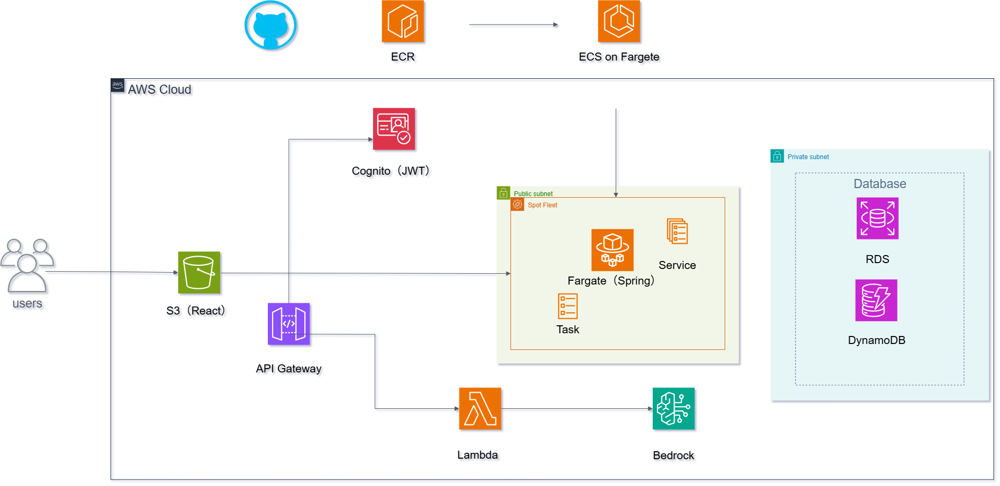
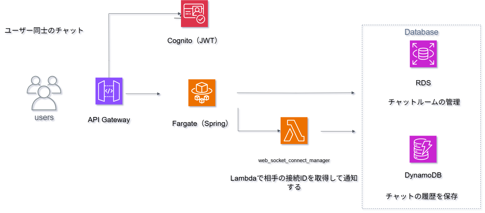
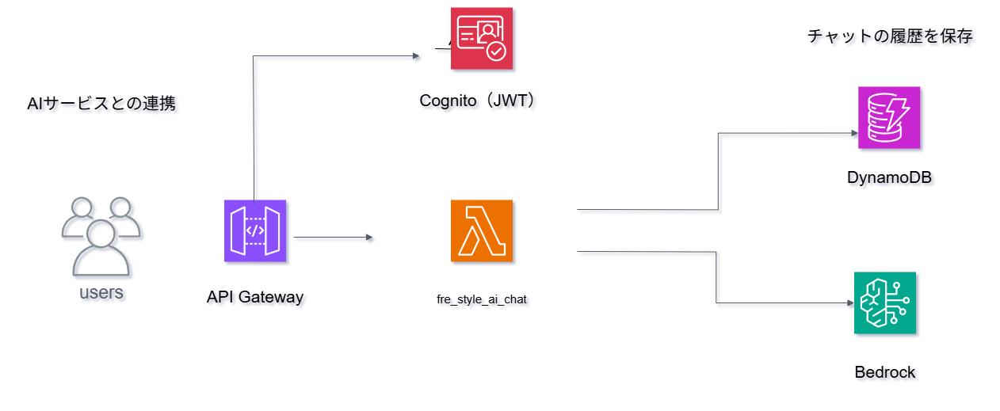

# FreStyle
ユーザー、AIとのチャットで手軽にコミュニケーションが取れるようにしたアプリです

AWS上にデプロイをしました

## 🧰 使用技術
- **Frontend:** React / Tailwind CSS  
- **Backend:** Spring Boot / lambda
- **Infrastructure:** AWS (ECS, RDS, S3, Route53, DynamoDB, lambda, Cognito, API Gateway)  
- **CI/CD:** GitHub Actions 
- **Database:** MariaDB,DynamoDB

## ⚙️ 主な機能
- ユーザー登録・ログイン（JWT認証,OIDC）
- ユーザー同士のチャット、AIとのチャット
- プロフィール編集
- Googleログイン
- GitHub Actionsによる自動デプロイ


## 💡 工夫した点
- WebSocket、Httpの二つでアーキテクチャーを分断したことWebsocket通信ではAPI Gateway,lambdaでHttpではECSを使用をしている
- CloudFormationを用いたインフラのコード管理
- JWT認証をHttpOnly Cookieにし、バックエンド側でフィルターを用いてヘッダーにJWTトークンをセットをしセキュリティー面を考慮した
- OIDCを実現したいため、CloudFrontでHttps化,グローバル化をした


## フロントエンドセットアップ手順

1. リポジトリをクローンして `frontend` ディレクトリに移動します。

2. `npm install` を実行し、`package.json` に記載されている依存パッケージをインストールして `node_modules` を作成します。

3. `npm run dev` で動作確認を行います。

4. Tailwind CSSの動作も確認してください。  
   ※ 使用しているNode.jsのバージョンによっては、Tailwind CSSが正常に動作しない可能性があります。

5. 動作しない場合は、一度 Tailwind CSSをアンインストールします。  
   ```bash
   npm uninstall tailwindcss
   
6. そのあとにもう一度インストールをします。
   ```bash
   `npm install -D tailwindcss@バージョン指定`

7.  `npx tailwindcss init -p` で初期設定をします。


## AWSアーキテクチャ構成図

以下は本アプリケーションのAWS構成図です。




###　ユーザー同士のチャット



## AIとユーザーのチャット


