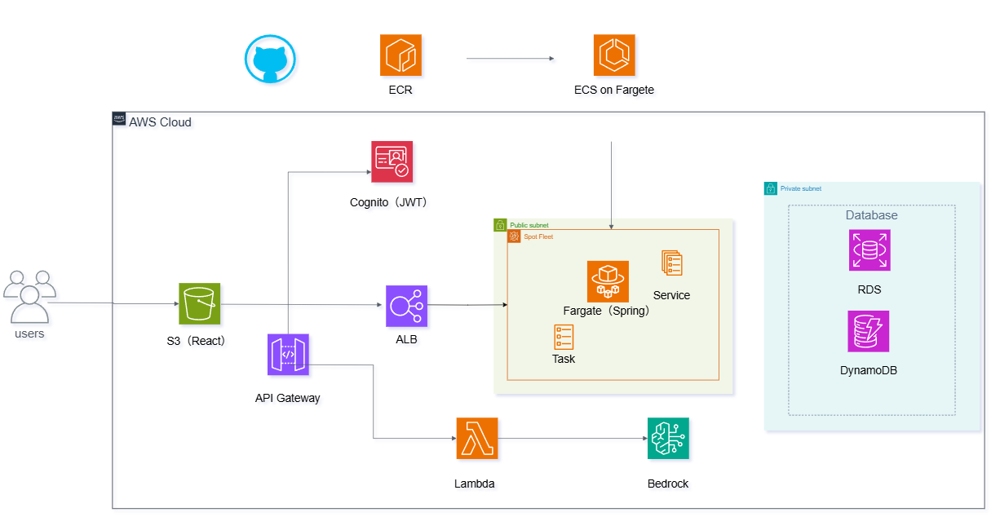
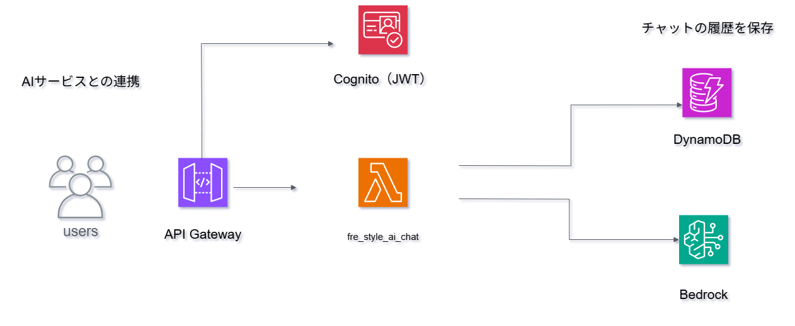
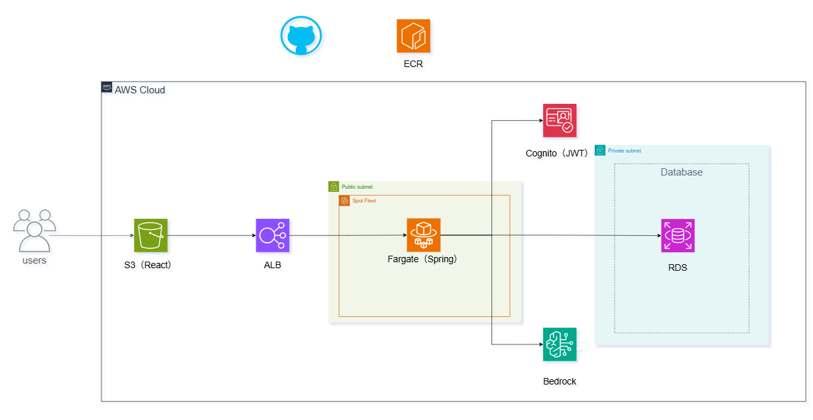

## 📱 FreStyleとは

**💬 チャット × 😊 対面 ――「印象のズレ」をAIが解消します。**

同じ言葉でも、チャットと対面では受け取り方が違う。
FreStyleは、友達とのチャットをAIが分析し、相手にどう伝わっているかを可視化。
「もっとこう言えば良かった」に気づける、コミュニケーション改善アプリです。

**使い方は3ステップ：**
1. 💬 友達とチャットする
2. 🤖 AIに会話を分析してもらう
3. ✨ 印象のギャップを知り、改善のヒントを得る

---

## 🌐 デプロイURL（料金の関係上サービスを停止する可能性があります）

👉 [https://normanblog.com](https://normanblog.com)

---

## 🎥 Demo（変更前）

👉 [デモ動画](https://myapp-demo-videos.s3.ap-northeast-1.amazonaws.com/Fre-Style-demo.mp4)

---

## 🧰 使用技術

<h3>Frontend</h3>
<a href="https://skillicons.dev">
  
</a>

<h3>Backend</h3>
<a href="https://skillicons.dev">
  
</a>

<h3>Infrastructure</h3>
<a href="https://skillicons.dev">
  
</a>

<h3>Database</h3>
<a href="https://skillicons.dev">
  
</a>

<h3>CI/CD</h3>
<a href="https://skillicons.dev">
  
</a>

### AWS サービス詳細

| カテゴリ | サービス |
|---------|----------|
| **Compute** | ECS (Fargate), Lambda |
| **Networking** | API Gateway, Route53, CloudFront, ALB |
| **Database** | RDS (MariaDB), DynamoDB |
| **Storage** | S3 |
| **Auth** | Cognito |

---

## ⚙️ 主な機能
- ユーザー登録・ログイン（JWT 認証 / OIDC）
- ユーザー同士のリアルタイムチャット
- AI アシスタントとのチャット
- プロフィール編集
- Google ログイン
- GitHub Actions による自動デプロイ

---

## 💡 Architecture Highlights（工夫した点）

### ① WebSocket と HTTP API の構成を用途別に完全分離
- **WebSocket**：API Gateway + Lambda + DynamoDB  
- **HTTP（Rest API）**：ECS（Fargate） + Spring Boot  

リアルタイム性と低コストを優先した WebSocket と、安定稼働・複雑処理に適した HTTP API を分離し、性能・コスト・可用性の最適化を実現。

### ② JWT（HttpOnly Cookie）× Spring Security の安全な認証設計
- JWT を HttpOnly Cookie に保存（XSS 対策）
- アクセストークンの有効期間を短くしリフレッシュトークンで再発行をする
- OIDC & JWK を活用した堅牢な認証フロー
- OIDC経由でも当該アプリ経由でも同一ユーザーとして認識

### ③ CloudFront によるグローバル最適化と HTTPS 化
- 高速配信（CDN）
- OIDC と組み合わせてセキュアなフロント構成
- Cognito/OIDCログインを使用しているのでHTTPSの必須になるので採用した

---

## 🧠 苦労した点・学び
- WebSocket を ECS で保持するか、サーバーレスにするかの検討 → コスト/工数削減/レイテンシから Lambda + APIGW に決定
- Spring Security の JWT / JWK / Cookie 設計
- ALB の TLS Termination と ECS の Backend 構成

---

## ✔ 技術選定理由（HTTP API / ECS Fargate）

1. Docker 化した Spring Boot を安定稼働させるため
   - サーバープロビジョニング不要
   - OS 管理不要

2. ALB と連携した柔軟なルーティング
   - ホストベースルーティングで[BeStyle](https://normanblog.com)にも同じロードバランサーを使用をしコスト削減をした
   - ヘルスチェックをしておりSpring Bootのactuatorでヘルスチェックのエンドポイントにアクセス

3. Blue/Green デプロイ
   - CodeDeploy と連携
   - 新バージョンのヘルスチェック後に切替
   - 即時ロールバック可能

---

## ✔ 技術選定理由（WebSocket / サーバーレス構成）

1. コスト最適化（従量課金）  
   ECS 常時稼働より大幅に低コスト。

2. 低レイテンシ & シンプルな処理  
   Lambda → DynamoDB の最短経路。

3. サーバーレスで構成統一
   - フルマネージド
   - 自動スケーリング
   - 運用負荷最小

---

## 🏗️ AWSアーキテクチャ構成図

### AWS全体構成図（変更前）


### ユーザー同士のチャット（変更前）


### AIとユーザーのチャット（変更前）


### 変更後のAWSアーキテクチャー図


### なぜアーキテクチャーを変えたのか
1. AIへのフィードバックにユーザーがより自分の性格を把握できるように複雑なクエリを実行する必要があったのでDynamoDBではサービス層が複雑になるのでRDSに変更をした
2. Lambda + API Gatewayではトラフィック量が多くなったときに捌きにくいこと
3. 機能の拡張性を踏まえたらECS一本で使用したほうがSQSなどを設定したときに工数を割くことができる

---

## 🚀 今年の目標

### 技術・資格
- AWS SAP
- GO言語でgRPC通信でサービス間接続
- Ruby on Railsでの規模の大きいモノリスを作成した後(テーブルが大体50個〜70個ぐらい)モジュラーモノリスとして刷新する
- ドメインの知識をつけるために日商簿記二級を取得をする

### 機能拡張
- 音声チャット
- Polly による AI 音声解答可能
- SageMakerを使用をしチャットの内容をクラスタリングで感情分析をすること
- 未読、既読、プッシュ通知機能の作成でSQS、SNSを使用をする
- チャット以外にもパーソナリティーが見えるシステムを作成する

---

## 🛠 フロントエンドセットアップ手順

```bash
# 1. リポジトリをクローンして frontend ディレクトリに移動
cd frontend

# 2. 依存パッケージをインストール
npm install

# 3. 動作確認
npm run dev

# 4. Tailwind CSS が動作しない場合
npm uninstall tailwindcss
npm install -D tailwindcss@バージョン指定
npx tailwindcss init -p
```

---

## 📄 ライセンス

MIT License
