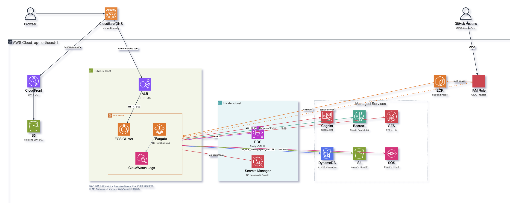
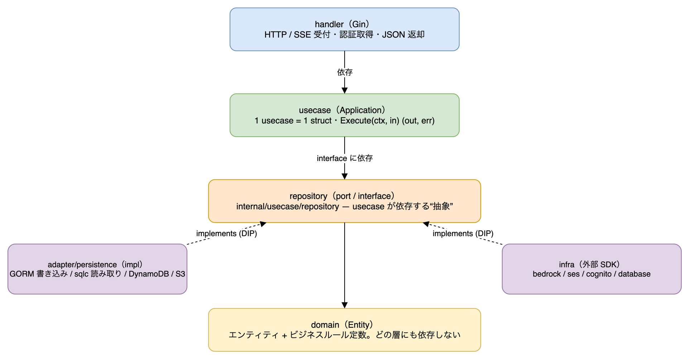
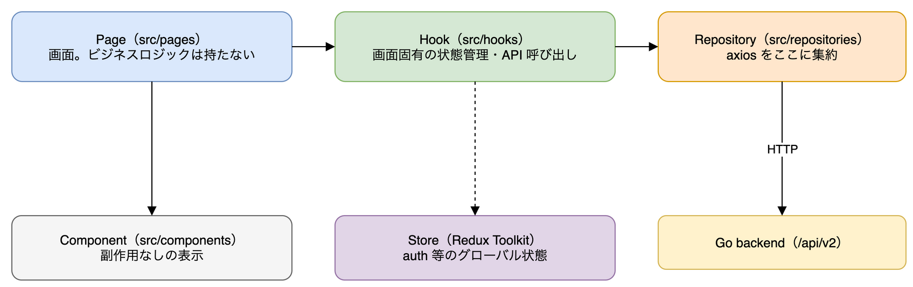
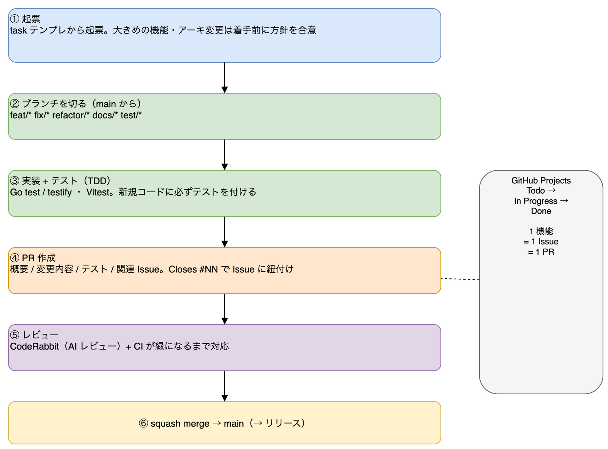
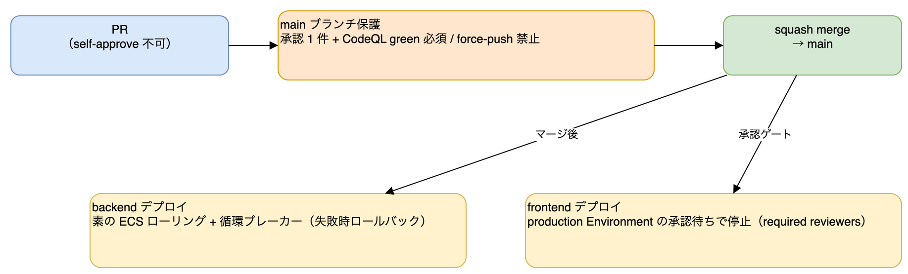
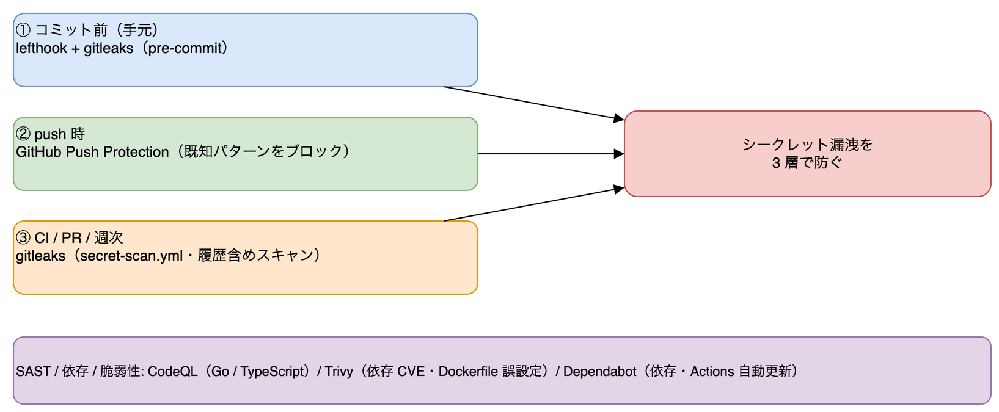

## FreStyle とは

新卒エンジニア向けに作成したプロダクトであり、主に新卒エンジニア向けの研修用のソフトウェアです。
このソフトウェアが解決することは研修用の資料が散在していてさまざまなツールを使用することに慣れていない新卒エンジニアの「探す」という余計な脳のリソースを
割くことなく本来の会社に必要な知識を吸収するのに最適化したプロダクトになっている

## なぜこのプロダクトを作成したのか？
- ツール散乱を解消: 教材・解答・進捗が 1 ヶ所にまとまる
- メンターのナレッジを資産化: 元々スライドの資料などに書き留めていてDriveにアップロードするなどの手間はなくなりこのアプリだけで完結をする
- シングルタスク化: 新卒は「アプリを切り替える」「資料を探す」コストをゼロにし、開発・問題演習・写経・実行を 1 画面で完結

### コア機能（実装済 / 維持）

| 機能 | 概要 |
|---|---|
| **AI チャット** | Bedrock を介した汎用 AI チャット。質問・要約・コードレビュー依頼など自由対話。Markdown レンダリング + ストリーミング表示 |
| **コード学習** | 演習問題を解きながら手を動かしてプログラミングを学ぶ。Monaco Editor + 言語サンドボックス（PHP / Go / bash / **SQL**）。SQL は同居の使い捨て PostgreSQL に対し非 superuser で実行し方言を正確に再現 |
| **学習コース** | CompanyAdmin が作成した Markdown 教材をコース単位で閲覧。trainee は各教材を「完了にする」でチェックでき、コースごとの進捗バー（完了数 / 全体）で到達度を可視化 |
| **ノート** | 学習ログ・振り返りメモを残せる。画像添付に対応 |
| **レポート** | 月次の学習サマリー |
| **通知** | システム通知（招待・案内など） |
| **プロフィール** | 表示名・アイコン・所属の確認 / 編集 |
| **管理（SuperAdmin / CompanyAdmin）** | 会社一覧 / 招待管理（CompanyAdmin から trainee を招待） |


## デプロイURL

[https://normanblog.com](https://normanblog.com)


## システム構成（全体像）

ユーザーのブラウザから、フロントエンド（静的配信）とバックエンド（API / SSE）に分かれて届き、バックエンドが各データストア・AI・認証サービスを束ねます。


- **フロントエンド**: React 19 / TypeScript / Vite / Tailwind。ビルド成果物を **CloudFront + S3** で配信。
- **バックエンド**: Go / Gin / GORM。**ALB + ECS Fargate**（+ コード実行用の `code-runner` サイドカー）。
- **データ / 連携**: メイン DB は **Supabase(PostgreSQL)**、AI チャット履歴は **DynamoDB**、非同期は **SQS**、AI は **Bedrock(Claude)**、メールは **SES**、認証は **Cognito(JWT を HttpOnly Cookie)**。

> 図のソース: [`docs/images/readme-system.drawio`](docs/images/readme-system.drawio)（draw.io で編集 → `drawio --export` で再生成）。AWS リソースレベルの詳細図は下の「[AWSアーキテクチャ構成図](#awsアーキテクチャ構成図)」を参照。

## 使用技術

<h3>Frontend</h3>
<a href="https://skillicons.dev">

</a>

<h3>Backend</h3>
<a href="https://skillicons.dev">

</a>

> Go / Gin / GORM / PostgreSQL（`backend/`）。クリーンアーキテクチャ（依存方向を archlint で強制）。

<h3>Infrastructure</h3>
<a href="https://skillicons.dev">

</a>

<h3>Database</h3>
<a href="https://skillicons.dev">

</a>

<h3>CI/CD</h3>
<a href="https://skillicons.dev">

</a>

> GitHub Actions / Gradle / JUnit 5 / Spring Boot Test + H2 / CodeQL / Trivy / gitleaks / Vitest coverage / ESLint / tsc

<h3>Testing</h3>
<a href="https://skillicons.dev">

</a>

> Vitest + React Testing Library（フロントエンド単体）/ JUnit 5 + Spring Boot Test（バックエンド単体・結合）/ Playwright（本番 E2E スモーク、Chromium）
---

## 工夫した点

### プロダクト面
- 今までの経験で自分が苦に感じたことをベースに何をしたら一番早く新卒のエンジニアが現場に入るまでの必要最低限な知識が身につけられるのかを考えました。
  まず情報設計について調べており、日本人が一覧性のUIを日頃みることが多いらしくスターバックスのUIで日本とアメリカとの違いでありました。
  なのでその性質上さまざまな情報源が散財していることもUIと同様日本人向けではないのではないかと思いこのプロダクト作成に至りました。


### 技術面：
- Cognito発行のJWT を HttpOnly Cookie に保存（XSS 対策）
- アクセストークンの有効期間を短くしリフレッシュトークンで再発行
- OIDC & JWK を活用した堅牢な認証フロー（Google認証をできるようにした）
- NoSQL、RDBのユースケースによって適した使い分け
- バックエンドはアーキテクチャを言語非依存に保ち、Go と Java/Spring Boot を行き来して比較検証してきた。極小 Fargate + 夜間 teardown の構成では **Go の即起動・低メモリ** が有利なため、現在は **Go / Gin / GORM** を本番採用し、**クリーンアーキテクチャ（依存方向を `archlint` で強制）** で構成している（`backend/`）。ECS Fargate 最小スペックで運用
- 夜間は ECS を停止してコストを抑える運用（詳細は[インフラリポジトリ](https://github.com/norman6464/frestyle-infrastructure)の docs を参照）

| 観点 | 数値 |
|---|---|
| ECS Fargate スペック | 0.25 vCPU / 0.5 GB（最小） |
| ランタイム | Go（静的バイナリ）/ Gin |
| スキーマ管理 | GORM AutoMigrate（破壊系は手動 SQL）|
| 永続化 | 読み取り=生 SQL 直書き（`db.Raw` / sqlc）・書き込み=GORM（PostgreSQL）/ AWS SDK v2（DynamoDB・S3・Bedrock・SQS）|

## AWSアーキテクチャ構成図



draw.io ソース: [`architecture/aws/freestyle-aws-architecture-current.drawio`](./architecture/aws/freestyle-aws-architecture-current.drawio)

---

## クリーンアーキテクチャ

バックエンドは **クリーンアーキテクチャ**で構成し、**依存方向は常に内側（domain）へ**向けます。`usecase` は具体実装ではなく **repository の interface（port）**に依存し、実装（`adapter/persistence` / `infra`）が DIP でその interface を満たします。この依存方向は自作の **`archlint`** が CI で機械的に強制します。



| 層 | パッケージ | 責務 | 許される依存 |
|---|---|---|---|
| **handler** | `internal/handler` | Gin で HTTP / SSE を受け、認証情報を取得して usecase を呼び、JSON を返す | usecase / domain |
| **usecase** | `internal/usecase` | 1 ユースケース = 1 struct。`Execute(ctx, in)` でビジネスロジックを実行 | domain / repository（**interface のみ**）|
| **repository(port)** | `internal/usecase/repository` | usecase が依存する永続化の**抽象（interface）** | domain |
| **repository(impl)** | `internal/adapter/persistence` | GORM 書き込み / sqlc 読み取り / DynamoDB / S3 など | domain |
| **infra** | `internal/infra/*` | 外部 SDK ラッパ（bedrock / ses / cognito / database） | domain |
| **domain** | `internal/domain` | エンティティ + ビジネスルール定数。**どの層にも依存しない** | （なし）|

### フロントエンドの層

フロントエンドにも同じ発想でレイヤーを適用します（`Page → Hook → Repository → API`）。



- **Page**（`src/pages`）は画面のみ・ロジックを持たない。**Hook**（`src/hooks`）が状態管理と API 呼び出しをまとめ、**Repository**（`src/repositories`）に axios を集約。
- **Component**（`src/components`）は副作用なしの表示、**Store**（Redux Toolkit）は auth 等のグローバル状態。

> 図のソース: [`docs/images/readme-clean-arch.drawio`](docs/images/readme-clean-arch.drawio) / [`docs/images/readme-frontend-arch.drawio`](docs/images/readme-frontend-arch.drawio)。各層の責務・命名規約の詳細は [`backend/README.md`](./backend/README.md) を参照。

---

## 開発に参加する

開発の規約（ブランチ / コミット / アーキテクチャ / テスト / PR フロー）は **[CONTRIBUTING.md](./CONTRIBUTING.md)** にまとめています。PR / Issue はテンプレートに沿って作成してください。

## ローカル開発環境セットアップ

### バックエンド (Go / Gin) — `backend/`

```bash
cd backend

# 1) ビルド + 検証（gofumpt 整形 / vet / build / test / archlint 等を一括）
go mod download
make verify
make fmt                   # gofumpt -w で整形（commit 前）

# 2) ローカル起動
go run ./cmd/server
# 本番相当の Supabase に繋ぐ場合は環境変数で注入:
#   export DATABASE_URL='postgresql://...pooler.supabase.com:6543/postgres?sslmode=require'
#   go run ./cmd/server

# 3) 動作確認
curl http://localhost:8080/api/v2/health
```

Docker でビルドする場合:

```bash
cd backend
docker build -t frestyle-backend:dev .   # PHP/Go/JDK 同梱(コード実行サンドボックス用)
docker run --rm -p 8080:8080 frestyle-backend:dev
```

> レイヤ構成・コーディング規約・データアクセス方針の詳細は [`backend/README.md`](./backend/README.md) を参照。

### フロントエンド

```bash
# 1. リポジトリをクローンして frontend ディレクトリに移動
cd frontend

# 2. 依存パッケージをインストール
npm install

# 3. 動作確認
npm run dev

# 4. Tailwind CSS が動作しない場合
npm uninstall tailwindcss
npm install -D tailwindcss@バージョン指定
npx tailwindcss init -p
```

---


### コーディング規約（要点）

バックエンドは **Go / Gin / GORM** で、**クリーンアーキテクチャ**（依存方向を `archlint` で機械的に強制）を採用する。

- **依存方向**: `handler → usecase → repository(port) / infra → domain` の一方向を厳守。port は `usecase/repository`、実装は `adapter/persistence`。外部サービス（S3 / DynamoDB / Bedrock / SQS / Cognito）との境界 = `infra` を **interface で DIP** し、本番実装と stub を差し替え可能にする
- **1 usecase = 1 ビジネスルール**: 新規機能は usecase を新規作成し、肥大化させない（採点のように関心が跨る処理は専用 usecase に切り出す）
- **データアクセス**: 読み取り=生 SQL 直書き（`db.Raw` / 段階的に sqlc）・書き込み=GORM のハイブリッド
- **テスト必須**: 新規追加コードには必ずテスト（`testing` + testify）を付ける。TDD を基本とし、**古典学派**（実 DB・実ルータ + 手書き fake で状態検証）

> レイヤ構成・コーディング規約・データアクセス方針の詳細は [`backend/README.md`](./backend/README.md) を参照。

### テスト戦略（単体 / 結合 / E2E の定義）

このアプリでの各テスト種別の定義・対象・ツール・配置は次のとおり。

| 種別 | このアプリでの定義 | 主な対象 | ツール / 実行 |
|---|---|---|---|
| **単体テスト (unit)** | 1 つの関数・ユースケースを依存から隔離して検証する。外部依存（DB / HTTP / AWS）は interface 経由で **手書き fake / stub** に差し替え、実 I/O を行わない（古典学派＝状態検証） | backend: usecase / 純粋ロジック（採点等） / frontend: component・hook・repository | `testing` + testify / Vitest |
| **結合テスト (integration)** | 複数層を実際に繋いで検証する。DB は本物の PostgreSQL（`//go:build integration`）、外部 AWS は stub に差し替える | backend: handler（`httptest` で本物の Gin ルータ）・repository（本物の Postgres で SQL / 制約 / 並び順） | `testing` / Postgres |
| **E2E テスト** | 実ブラウザ（Chromium）で本番 URL に対しユーザー導線を端から端まで検証する | デプロイ済み本番のスモーク（SPA ロード / セキュリティヘッダー / 認証境界） | Playwright |

#### バックエンド (Go) — `go test` / `make verify`

`testing` + testify。古典学派（実 DB・実ルータ + 手書き fake）。技法はアプリ内コース「テスト徹底入門（Go）」も参照。

- **純粋ロジック / usecase（単体）**: 依存は interface を満たす **手書き fake**（map で状態・`err` フィールドでエラー注入）に差し替え、`Execute` の戻り値・状態を検証。
- **handler（結合）**: `httptest` + 本物の `gin` ルータでルーティング〜バインド〜ステータス〜JSON を通しで検証。認証はテスト用 middleware で context に user を注入。
- **repository（結合）**: 本物の **PostgreSQL**（`//go:build integration`）に実 SQL を流し、マッピング・並び順・集計・`FILTER` / `BOOL_OR` 等まで検証。
- **infra（境界）**: Bedrock / DynamoDB / S3 / SQS / Cognito は `Stub*` 実装に差し替え、AWS 資格情報の無い環境でも起動・テストできる。
- **相互作用検証（testify/mock）**は「呼ばれたこと自体が仕様」のときだけ。

```bash
cd backend
go test ./...                          # 単体（DB 不要）
make test-integration                  # 本物の Postgres に対する結合テスト
make verify                            # gofumpt / vet / build / test / 3 linter を一括
```

#### フロントエンド (Vitest + React Testing Library) — `npm test`

セットアップは `frontend/src/test/setup.ts`。

- **component（単体）**: `render` + `screen.getByRole` でアクセシビリティ込みに描画検証、`fireEvent` でイベント発火。`localStorage` 等は `vi.stubGlobal` でスタブ。
- **hook（単体）**: `renderHook` で状態遷移・副作用を検証。例: `src/hooks/__tests__/*.test.ts`。
- **repository（単体）**: axios を `vi.mock` で差し替え、API 呼び出しの URL / payload / レスポンス整形を検証。例: `src/repositories/__tests__/AuthRepository.test.ts`。

```bash
cd frontend
npm test                 # watch
npm run test:run         # 1 回実行（CI と同じ）
npm run test:run -- --coverage
```

E2E は **2 系統**に分かれる。

**(a) 本番スモーク（外形監視）** — `frontend/e2e/smoke.spec.ts` / 設定 `playwright.config.ts`

デプロイ済み本番（既定 `https://normanblog.com`）に対する **未認証スモーク**（SPA ロード / CloudFront セキュリティヘッダー / CSP meta / `GET /api/v2/health` 200 / 認証必須エンドポイントの 401 / 廃止路の 404・401）。

**(b) ローカルビルド + API モック（認証付き導線）** — `frontend/e2e/local/*.spec.ts` / 設定 `playwright.local.config.ts`

`vite preview` で配信したビルド済み SPA に対し、Playwright の `page.route` で `/api/v2/**` をモックして認証付きの主要画面を検証する。`GET /auth/me` のレスポンスで認証状態を制御する（401→未認証で `/login` リダイレクト、200+`role`→認証済みで AppShell 描画）。**本番 Cognito / DB に一切触れない**ため CI で毎回安全に回せる。ビルドは `VITE_API_BASE_URL=''`（同一オリジン相対）で行い、`index.html` の CSP `connect-src 'self'` に収めてモックを差し込める状態にするのが要点。

```bash
cd frontend
npm run e2e:install                                       # 初回のみ（Chromium + OS deps）
npm run e2e                                                # (a) 本番スモーク
npm run e2e:local                                         # (b) ローカルビルド + API モック（要 build）
npm run e2e:ui                                             # UI モードでデバッグ
PLAYWRIGHT_BASE_URL=http://localhost:5173 npm run e2e      # (a) をローカル dev server に向ける
```

CI（`e2e.yml`）は **smoke（本番）** と **local-mocked（ローカル + モック）** の 2 ジョブで実行する。

#### CI でのテスト実行

| ワークフロー | 実行内容 |
|---|---|
| backend (Java) | `./gradlew test`（JUnit 5 + Spring Boot Test + H2 結合 + Flyway 適用検証）。Gradle ベースの CI を移行に合わせて整備中 |
| `ci-frontend.yml` | `tsc` / ESLint / **Vitest + カバレッジ閾値**（lines/statements/functions/branches）/ build |
| `e2e.yml` | Playwright スモーク（本番）+ ローカルモック認証 E2E |
| `codeql.yml` / `trivy.yml` / `secret-scan.yml` | SAST（Java / TypeScript）/ 依存 CVE・Dockerfile 誤設定 / gitleaks シークレットスキャン |

> **カバレッジ閾値ゲート**: frontend は `vitest.config.js` の `coverage.thresholds` を下回ると CI を fail させる。backend（Java）は JaCoCo で計測し、新規追加コードは 80% 以上を目標にする。

---

## チーム開発の進め方（概要）

複数人での開発を前提に、計画 → 実装 → レビュー → リリースの流れを仕組みで揃えている。



- **カンバン**: GitHub Projects で「Todo / In Progress / Done」を管理し、**1 機能 = 1 Issue = 1 PR** を基本とする。
- **起票**: テンプレート（`task`）から起票する。大きめの機能・アーキテクチャ変更は、実装前に背景・目的 / スコープ / 設計 / 代替案 / 運用 / テストの観点で方針を合意してから着手する。
- **ブランチ**: `feat/*` `fix/*` `refactor/*` `docs/*` `test/*` を main から切る。コミット・PR・Issue は日本語。
- **PR**: 本文は `## 概要 / ## 変更内容 / ## テスト / ## 関連 Issue` を基本形式とし、**対応 Issue に必ず紐付ける**（`Closes #NN`）。レビュアーが設計から辿れるようにする。
- **レビュー**: PR ごとに **CodeRabbit（AI レビュー）** と CI が走り、緑になってから **squash merge**。
- **テスト必須**: 新規コードには必ずテストを付ける（バックエンド Go test / testify / フロントエンド Vitest）。TDD を基本とする。
- **ドキュメント必須**: 取り組んだ内容・手順は `docs/` に残す（ドキュメント更新の無い PR はマージしない）。

詳細な規約は [CONTRIBUTING.md](./CONTRIBUTING.md) を参照。

## セキュリティ / 本番保護

チーム開発での「誤って本番に影響」「シークレット漏洩」を、人的ミスを前提に多層で防ぐ。

**ブランチ保護 → マージ → 本番デプロイの保護フロー**:



**シークレット漏洩の多層防御（コミット前 → push → CI の 3 層）**:



- **ブランチ保護**: `main` は PR に**承認 1 件 + CodeQL green が必須**。自分の PR は self-approve 不可（必ずレビューを経る）。force-push 禁止。
- **本番デプロイの承認ゲート**: マージ即本番反映ではない。**frontend は `production` Environment**（required reviewers = `@norman6464`）の承認待ちで停止する。**backend は素の ECS ローリングデプロイ + 循環ブレーカー（失敗時ロールバック）** で更新する。Code シリーズ（CodePipeline + CodeDeploy ECS Blue/Green）は IaC リポで再設計中。
- **シークレット漏洩の多層防御**:
  - GitHub **Push Protection**（既知パターンを含む push をブロック）
  - **gitleaks** CI（`secret-scan.yml`、PR / main / 週次で履歴含めスキャン）
  - **lefthook + gitleaks** の pre-commit（コミット前に手元で検知）
- **SAST / 依存 / 脆弱性**: CodeQL（Go / TypeScript）、**Trivy**（依存 CVE / Dockerfile 誤設定）、**Dependabot**（依存・Actions の自動更新）。

詳細・セットアップ手順は [CONTRIBUTING.md](./CONTRIBUTING.md) §6〜§8 を参照。

## ライセンス

MIT License
