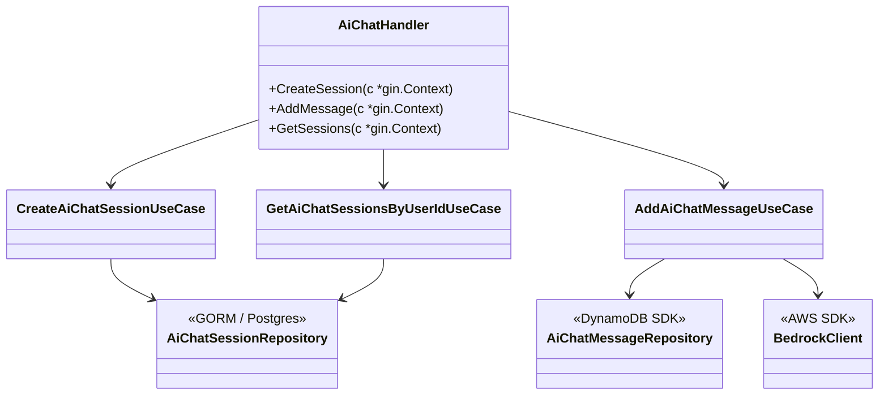
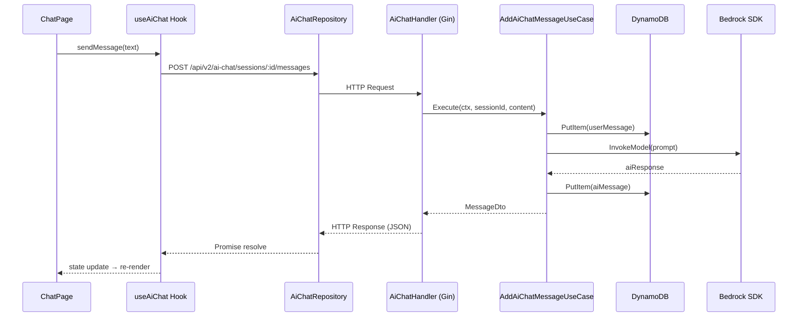

## FreStyle とは

**新卒 IT エンジニア向け統合研修プラットフォーム（B2B SaaS）**

開発の現場に入ったばかりの新卒エンジニアは、Box / Google Drive / PowerPoint / Notion / Slack / GitHub / 紙資料 …… と **散らばった研修ツールを行き来するだけで疲弊**してしまいがちです。FreStyle は、企業のメンター（教育担当エンジニア）が作った教材・問題集・コーディング課題・ビジネスコミュニケーション練習を **1 つのプラットフォーム上に集約**し、新卒が "学ぶことそのもの" に集中できる環境を提供します。

## なぜ作るのか（プロダクトの意義）

- **ツール散乱を解消**: 教材・解答・進捗・コミュニケーション練習が 1 ヶ所にまとまる
- **メンターのナレッジを資産化**: 各社の教育担当が時間をかけて作ったスライドや手順書を、再利用可能な構造化教材に変える
- **シングルタスク化**: 新卒は「アプリを切り替える」「資料を探す」コストをゼロにし、開発・問題演習・写経・実行を 1 画面で完結
- **早期戦力化を支援**: Git/Git Flow、社内で使うプログラミング言語、コーディング規約、業務上のコミュニケーションを実際にやって覚える設計

## ロール

| ロール | 例 | できること |
|---|---|---|
| **SuperAdmin** | FreStyle 運営側 | 顧客企業の登録、CompanyAdmin の招待、課金管理、横断監査 |
| **CompanyAdmin** (メンター) | 各社の教育担当エンジニア | 自社の教材・問題・解答 CRUD、自社新卒の招待、進捗ダッシュボード |
| **Trainee** (新卒) | 各社の新卒エンジニア | 自社の教材で学習・問題演習・コード実行・ビジネスコミュニケーション練習 |

## 機能（コア構成）

プロダクトをコア機能だけに絞り、新卒エンジニアが「学ぶこと」と「手を動かすこと」に集中できる最小構成にしました。

### コア機能（実装済 / 維持）

| 機能 | 概要 |
|---|---|
| **AI チャット** | Bedrock を介した汎用 AI チャット。質問・要約・コードレビュー依頼など自由対話。Markdown レンダリング + ストリーミング表示 |
| **コード学習** | 演習問題を解きながら手を動かしてプログラミングを学ぶ。Monaco Editor + 言語サンドボックス（PHP から拡充予定） |
| **ノート** | 学習ログ・振り返りメモを残せる。画像添付に対応 |
| **レポート** | 月次の学習サマリー |
| **通知** | システム通知（招待・案内など） |
| **プロフィール** | 表示名・アイコン・所属の確認 / 編集 |
| **管理（SuperAdmin / CompanyAdmin）** | 会社一覧 / 招待管理（CompanyAdmin から trainee を招待） |

### 認証・組織モデル

- マルチテナント（会社単位でデータ分離）
- ロール: `super_admin` / `company_admin` / `trainee` の 3 階
- **招待マジックリンク方式（SES + token）** で初回サインアップ
- OIDC（Cognito Hosted UI / Google フェデレーション）+ 招待限定サインアップ
- 詳細: [frestyle-pdm/docs/auth/auth-flow-screen-transitions.md](https://github.com/norman6464/frestyle-pdm/blob/main/docs/auth/auth-flow-screen-transitions.md)

### 削除した機能（過去に持っていたが整理済）

ゲーミフィケーション系・ビジネスコミュニケーション研修系の機能は、コア機能（AI 自由対話 + コード学習）に集中するため整理しました:

- 練習モード（ロールプレイ）/ シナリオ管理 / スコアカード / スコア履歴
- お気に入りフレーズ / 会話テンプレート / 練習リマインダー / 共有セッション
- 達成バッジ / 練習レベル / 今日の目標 / 今週の練習目標 / 本日のチャレンジ
- 今日の一言 / 今日の Tips / 次のステップ / ウィークリーチャレンジ / ランキング

詳細は [frestyle-pdm/docs/architecture/saas-vision.md](https://github.com/norman6464/frestyle-pdm/blob/main/docs/architecture/saas-vision.md) を参照。

## 対象顧客

**自社開発をしている企業**を主たるターゲットとします。

- 自社プロダクトを開発しており、新卒・中途エンジニアを毎年複数名採用する Web / SaaS / 事業会社
- 社内に教育担当エンジニア（メンター）を確保できる規模の開発組織
- 「研修資料は Box / Drive / Notion / Slack に散らばっていて見つからない」という課題感を持つ教育担当者
- → SIer の元請け企業など、外部委託主体の組織は当面ターゲット外（OJT モデルとマッチしないため）

## オンボーディング（B2B 申請承認フロー）

```
顧客企業（教育担当）            FreStyle 運営 (SuperAdmin)         新卒 (Trainee)
       │                              │                                │
       │ 1. 利用申請（フォーム）           │                                │
       │─────────────────────────────►│                                │
       │                              │ 2. 承認・会社レコード作成              │
       │                              │ 3. 初代 CompanyAdmin 招待メール送信   │
       │ ◄────────────────────────────│                                │
       │ 4. CompanyAdmin として初回ログイン  │                                │
       │ 5. 教材を作成・新卒メンバーを招待     │                                │
       │─────────────────────────────────────────────────────────────►│
       │                              │                                │ 6. ログインして学習開始
```

- セルフサインアップは Phase 3 以降に検討
- 当面は SuperAdmin が手動承認することで、テナント品質と契約管理を担保

---

## デプロイURL（料金の関係上サービスを停止する可能性があります）

[https://normanblog.com](https://normanblog.com)

---

## 使用技術

<h3>Frontend</h3>
<a href="https://skillicons.dev">
  
</a>

<h3>Backend</h3>
<a href="https://skillicons.dev">
  
</a>

> バックエンド (Go / Gin / GORM) は `backend/` 配下で運用。
> 旧 Spring Boot 実装は廃止済み（移行完了後に削除）。

<h3>Infrastructure</h3>
<a href="https://skillicons.dev">
  
</a>

<h3>Database</h3>
<a href="https://skillicons.dev">
  
</a>

<h3>CI/CD</h3>
<a href="https://skillicons.dev">
  
</a>

<h3>Testing</h3>
<a href="https://skillicons.dev">
  
</a>

> Vitest + React Testing Library（フロントエンド単体）/ `go test`（バックエンド単体）/ Playwright（本番 E2E スモーク、Chromium）

### AWS サービス詳細

| カテゴリ | サービス | 用途 |
|---------|----------|------|
| **Compute** | ECS Fargate, ECR | Go (Gin) backend のコンテナ実行・イメージ管理 |
| **Networking** | CloudFront, ALB, Route 53, ACM | CDN（フロント SPA + セキュリティヘッダー）・ロードバランシング・DNS（旧 Cloudflare から移管）・TLS 証明書 |
| **Database** | RDS PostgreSQL 16, DynamoDB | リレーショナル DB（GORM 経由）・チャットメッセージ NoSQL |
| **Storage** | S3 | フロントエンド静的ホスティング・ノート画像 |
| **Auth** | Cognito | OAuth 2.0 / OIDC + JWT (HttpOnly Cookie)・SRP / Hosted UI |
| **Secrets** | Secrets Manager | RDS マスターパスワード（`ManageMasterUserPassword` で自動ローテーション） |
| **Messaging** | SQS (+ DLQ) | 非同期レポート生成キュー（Spring Boot 時代の遺産、Go 移行後は段階的に整理予定） |
| **Identity** | IAM (OIDC Provider) | GitHub Actions の AssumeRole（長期キー廃止、一時クレデンシャル運用） |
| **Monitoring** | CloudWatch Logs | ECS Task / RDS のログ集約 |
| **CI/CD** | GitHub Actions | 自動テスト・E2E (Playwright) ・cd-frontend / cd-backend |

---

## Architecture Highlights（工夫した点）

### ① HTTP / WebSocket を ECS + Go で単一経路化
- **HTTP API / WebSocket** ともに **ECS Fargate 上の Go (Gin)** に集約
- WebSocket は `gorilla/websocket` で ALB → ECS Task に直接 upgrade（Sticky Session 不要・stateless 化）
- 旧構成（Spring Boot 時代）の **API Gateway + Lambda + DynamoDB** のサーバレス WS は廃止し、ALB を 1 本にまとめてコスト・運用・可観測性を一元化
- フロントエンドは `wss://api.normanblog.com/api/v2/ws/...` で接続、Cognito JWT (HttpOnly Cookie) を Origin チェックと併用して認証

### ② JWT（HttpOnly Cookie）× Cognito の安全な認証設計
- JWT を HttpOnly Cookie に保存（XSS 対策）
- アクセストークンの有効期間を短くしリフレッシュトークンで再発行
- OIDC & JWK を活用した堅牢な認証フロー
- OIDC 経由でも当該アプリ経由でも同一ユーザーとして認識
- Go 側は Gin の middleware で JWT 検証（`golang-jwt/jwt` + AWS Cognito JWKS）を実装

### ③ CloudFront によるグローバル最適化と HTTPS 化
- 高速配信（CDN）
- OIDC と組み合わせてセキュアなフロント構成
- Cognito / OIDC ログインで HTTPS が必須なため採用

### ④ Spring Boot → Go (Gin + GORM) 移行完了

**2026 年 4 月 27 日**: 全 28 機能（Phase 1〜28）を Go (Gin + GORM) に移植し、Spring Boot 実装を廃止しました。フロントエンドは `/api/v2/*` 経由で Go バックエンドのみと通信します。

#### Go に移行した結果

| 観点 | Spring Boot (旧、廃止済み) | Go + Gin (現行) |
|---|---|---|
| ECS Fargate スペック | 2 vCPU / 4 GB（JVM オーバーヘッド分） | 0.25 vCPU / 0.5 GB（最小） |
| Fargate コスト見込み | ~$2.40/日 | ~$0.30/日（**約 80% 削減**） |
| 起動時間 | 数十秒（JVM warmup） | サブ秒 |
| バイナリサイズ | JRE + jar 約 200 MB+ | distroless + static binary 約 30 MB |
| 並行処理 | スレッドプール | goroutine（軽量） |

#### 移行手順（履歴）

- Phase 0: `backend/` 基盤（Gin + GORM + クリーンアーキ + Dockerfile + CI）
- Phase 1〜28: 機能（controller 単位）ごとに独立 issue / PR / squash merge
- 最終 cutover: フロントエンド repository を `/api/*` → `/api/v2/*` に一括切替、Spring Boot コード (`FreStyle/`) を完全削除

#### Go バックエンドのクリーンアーキテクチャ

Spring Boot 時代に確立した依存方向ルールを Go 側にも忠実に持ち込んでいます。

```text
┌────────────────────────────────────────────────────────────┐
│                  Presentation Layer                        │
│   handler (Gin)                                            │
└────────────────────────────────────────────────────────────┘
                       ↓
┌────────────────────────────────────────────────────────────┐
│                  Application Layer                         │
│   usecase（1 ユースケース = 1 ファイル）                    │
└────────────────────────────────────────────────────────────┘
                       ↓
┌────────────────────────────────────────────────────────────┐
│                    Domain Layer                            │
│   domain（純粋なドメイン構造体・ロジック）                   │
└────────────────────────────────────────────────────────────┘
                       ↓
┌────────────────────────────────────────────────────────────┐
│                Infrastructure Layer                        │
│   repository (GORM) / infra (Cognito / S3 / Bedrock SDK)   │
└────────────────────────────────────────────────────────────┘
```

ディレクトリ:

```
backend/
├── cmd/server/          エントリーポイント (main.go)
├── internal/
│   ├── handler/         HTTP ハンドラ層 (Gin)
│   ├── usecase/         ユースケース層 (1 ユースケース 1 ファイル)
│   ├── repository/      リポジトリ層 (GORM)
│   ├── domain/          ドメインモデル (純粋ドメイン構造体)
│   └── infra/
│       ├── config/      環境変数ロード
│       └── database/    GORM + PostgreSQL 接続
├── Dockerfile           multi-stage / distroless / static binary
└── go.mod
```

詳細な層責務・パッケージ依存関係・テスト戦略は [`frestyle-pdm/docs/ARCHITECTURE.md`](https://github.com/norman6464/frestyle-pdm/blob/main/docs/ARCHITECTURE.md) を参照。

#### 層構成（フロントエンド）

バックエンドと同じ発想でフロントエンドもレイヤー化しています。

```text
Page (画面)  →  Hook (Application)  →  Repository (axios)
  ↓
Component (Presentational)
```

#### 依存関係図（AI チャット機能 - Go 移植版の例）


```mermaid
classDiagram
    class AiChatHandler {
      +CreateSession(c *gin.Context)
      +AddMessage(c *gin.Context)
      +GetSessions(c *gin.Context)
    }
    class CreateAiChatSessionUseCase
    class AddAiChatMessageUseCase
    class GetAiChatSessionsByUserIdUseCase
    class AiChatSessionRepository {
      <<GORM / Postgres>>
    }
    class AiChatMessageRepository {
      <<DynamoDB SDK>>
    }
    class BedrockClient {
      <<AWS SDK>>
    }

    AiChatHandler --> CreateAiChatSessionUseCase
    AiChatHandler --> AddAiChatMessageUseCase
    AiChatHandler --> GetAiChatSessionsByUserIdUseCase

    CreateAiChatSessionUseCase --> AiChatSessionRepository
    AddAiChatMessageUseCase --> AiChatMessageRepository
    AddAiChatMessageUseCase --> BedrockClient
    GetAiChatSessionsByUserIdUseCase --> AiChatSessionRepository
```

#### データフロー: AI チャットへメッセージを送る（Go 版）


```mermaid
sequenceDiagram
    participant FE as ChatPage
    participant Hook as useAiChat Hook
    participant Repo as AiChatRepository
    participant H as AiChatHandler (Gin)
    participant UC as AddAiChatMessageUseCase
    participant DDB as DynamoDB
    participant Bed as Bedrock SDK

    FE->>Hook: sendMessage(text)
    Hook->>Repo: POST /api/v2/ai-chat/sessions/:id/messages
    Repo->>H: HTTP Request
    H->>UC: Execute(ctx, sessionId, content)
    UC->>DDB: PutItem(userMessage)
    UC->>Bed: InvokeModel(prompt)
    Bed-->>UC: aiResponse
    UC->>DDB: PutItem(aiMessage)
    UC-->>H: MessageDto
    H-->>Repo: HTTP Response (JSON)
    Repo-->>Hook: Promise resolve
    Hook-->>FE: state update → re-render
```

### ⑤ 初心者向けUIコンポーネントライブラリ

新卒エンジニアが迷わず使えるよう、`frontend/src/components/ui/` に共通UIコンポーネント群を整備しています。

| コンポーネント | 用途 |
|---|---|
| `PageIntro` | 全画面統一のページヘッダー |
| `FirstTimeWelcome` | 初回訪問時の導入カード（localStorage永続化） |
| `GlossaryTerm` | 専門用語の下線表示＋クリックで用語解説 |
| `HelpTooltip` | 「?」アイコン付きの補足説明 |
| `StepIndicator` | 多段階操作の進行状況可視化 |
| `GuidedHint` | 閉じるボタン付き初心者向けヒント |
| `ActionCard` | Link/Button両対応の強調CTAカード |

専門用語（5軸評価・論理的構成力・練習モードなど）の定義は `frontend/src/constants/glossary.ts` に集約。

---

## 苦労した点・学び
- **WebSocket の構成方針転換**: 当初は Lambda + API Gateway のサーバレス WebSocket でコスト最適化していたが、トラフィック増加時のスケール特性とコネクション管理（DynamoDB の `connectionId` テーブル）の運用負荷が嵩み、最終的に **ECS + `gorilla/websocket` の単一経路** に統一
- Spring Security の JWT / JWK / Cookie 設計を Go 移行後は **Gin middleware（`golang-jwt/jwt` + Cognito JWKS キャッシュ）** で再実装
- ALB の TLS Termination（ACM 証明書）と ECS Backend 間は HTTP（VPC 内）で割り切り、外向き HTTPS 強制は CloudFront の ResponseHeadersPolicy + HSTS で多層化
- Spring Boot の JVM オーバーヘッドにより Fargate 2 vCPU / 4 GB を要し、ランニングコストが嵩んでいた → Go (Gin + GORM) に置き換えて **0.25 vCPU / 0.5 GB へ縮退（約 80% コスト削減）**
- 既存資産を捨てない移行戦略の設計（path-based routing による Spring Boot / Go 並行運用 → 全機能 cutover 後に Spring Boot を完全削除）
- RDS マスターパスワードを **Secrets Manager の自動ローテーション**（`ManageMasterUserPassword=true`）に切替えて、`.env` での平文保管を撤廃

---

## 技術選定理由（HTTP API / ECS Fargate / Go）

1. **Go (Gin + GORM)** で書き直すことでコンテナ要求リソースを最小化
   - JVM が要求する 2 vCPU / 4 GB → 0.25 vCPU / 0.5 GB へ
   - 起動時間サブ秒、distroless で 30 MB 級の static binary
   - goroutine による軽量並行処理

2. **ECS Fargate** で Docker 化したアプリを安定稼働
   - サーバープロビジョニング不要 / OS 管理不要
   - 旧 Spring Boot 版から Go 版への切替は ECS Service 単位で blue/green に近い運用が可能

3. **ALB と連携した柔軟なルーティング**
   - ホストベースルーティングで [BeStyle](https://normanblog.com) にも同じロードバランサーを使用しコスト削減
   - ヘルスチェックは Go 側で `/api/v2/health` を提供し ALB Target Group が定期チェック

4. **Blue/Green デプロイ**
   - CodeDeploy と連携
   - 新バージョンのヘルスチェック後に切替
   - 即時ロールバック可能

---

## 技術選定理由（WebSocket / ECS 一本化）

旧構成（API Gateway + Lambda + DynamoDB）を廃止し、**ECS + Go (`gorilla/websocket`) の単一経路** に統一した理由:

1. **複雑なクエリの直行性**  
   AI フィードバックでユーザの過去スコア・性格傾向・チャット履歴を組み合わせる必要があり、DynamoDB だけだと application 側の join が肥大化。RDS（PostgreSQL）+ DynamoDB のハイブリッドにし、ECS 上の Go から両方を直接叩く方が単純。
2. **トラフィック増加時のスケール**  
   Lambda 同時実行数の上限・cold start・WS 切断時の再接続コスト（API Gateway の billing 単位）が運用上のリスクになっていた。ECS Fargate なら `desired count` で水平スケールでき、ALB のヘルスチェックで自己修復可能。
3. **可観測性とデプロイ単位の統一**  
   HTTP / WebSocket を 1 つの ECS Service に同居させると、ログ・メトリクス・デプロイ単位が 1 本化されて運用が楽（CloudWatch Logs Group を分けずに済む）。
4. **コスト**  
   Go バイナリは 0.25 vCPU / 0.5 GB Fargate で常時稼働しても月 $9 前後。WS のコネクション課金が無くなる分、トラフィックが伸びるほど ECS の方が有利。

---

## AWSアーキテクチャ構成図

### 現在のAWS全体構成図


### 旧AWS構成図

<details>
<summary>変更前の構成図（クリックで展開）</summary>

#### AWS全体構成図（変更前）


#### ユーザー同士のチャット（変更前）


#### AIとユーザーのチャット（変更前）


#### 変更後のAWSアーキテクチャー図


</details>

## ローカル開発環境セットアップ

### バックエンド (Go) — `backend/`

```bash
cd backend

# 1) 依存解決
go mod tidy

# 2) PostgreSQL 接続情報を環境変数に
export DB_HOST=localhost
export DB_PORT=5432
export DB_USER=postgres
export DB_PASSWORD=<password>
export DB_NAME=fre_style
export DB_SSLMODE=disable
export PORT=8080

# 3) 起動
go run ./cmd/server

# 4) 動作確認
curl http://localhost:8080/
# => {"message":"FreStyle Go backend (Phase 0 bootstrap)"}
```

Docker でビルドする場合:

```bash
cd backend
docker build -t frestyle-backend:dev .
docker run --rm -p 8080:8080 \
  -e DB_HOST=host.docker.internal \
  -e DB_USER=postgres -e DB_PASSWORD=<password> \
  -e DB_NAME=fre_style -e DB_SSLMODE=disable \
  frestyle-backend:dev
```

### フロントエンド

```bash
# 1. リポジトリをクローンして frontend ディレクトリに移動
cd frontend

# 2. 依存パッケージをインストール
npm install

# 3. 動作確認
npm run dev

# 4. Tailwind CSS が動作しない場合
npm uninstall tailwindcss
npm install -D tailwindcss@バージョン指定
npx tailwindcss init -p
```

---

## 本番環境DBマイグレーション

本番環境（AWS RDS PostgreSQL）にデプロイする際、スキーマの更新が必要な場合はマイグレーション SQL を実行してください。

### マイグレーション手順

```bash
# 1. AWS RDS (PostgreSQL) に踏み台 EC2 経由で接続
ssh -L 5432:<RDS_ENDPOINT>:5432 ec2-user@<BASTION>
psql -h localhost -U postgres -d fre_style

# 2. マイグレーション SQL を実行
\i backend/migrations/001_add_practice_mode_support.sql

# 3. 確認
\d ai_chat_sessions
SELECT COUNT(*) FROM practice_scenarios;
```

### マイグレーション一覧

| ファイル名 | 実行日 | 内容 |
|-----------|--------|------|
| `001_add_practice_mode_support.sql` | 2026-02-12 | 練習モード機能追加（`ai_chat_sessions` に `session_type`, `scenario_id` カラム追加、`practice_scenarios` テーブル作成、初期データ 12 件投入） |

**注意**: マイグレーションは冪等性があり、複数回実行しても安全です（`IF NOT EXISTS`, `ON CONFLICT DO NOTHING` を使用）。

GORM 側の AutoMigrate は本番では使わず、明示的な SQL で運用します（破壊的変更の検知漏れを防ぐため）。

---

## ライセンス

MIT License
