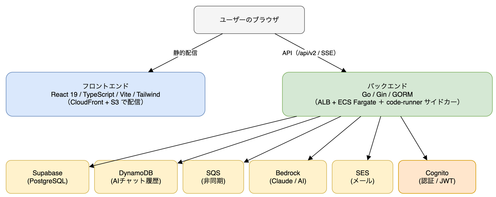

## FreStyle とは

新卒エンジニア向けに作成したプロダクトであり、主に新卒エンジニア向けの研修用のソフトウェアです。
このソフトウェアが解決することは研修用の資料が散在していてさまざまなツールを使用することに慣れていない新卒エンジニアの「探す」という余計な脳のリソースを
割くことなく本来の会社に必要な知識を吸収するのに最適化したプロダクトになっている

## なぜこのプロダクトを作成したのか？
- ツール散乱を解消: 教材・解答・進捗が 1 ヶ所にまとまる
- メンターのナレッジを資産化: 元々スライドの資料などに書き留めていてDriveにアップロードするなどの手間はなくなりこのアプリだけで完結をする
- シングルタスク化: 新卒は「アプリを切り替える」「資料を探す」コストをゼロにし、開発・問題演習・写経・実行を 1 画面で完結

### コア機能（実装済 / 維持）

| 機能 | 概要 |
|---|---|
| **AI チャット** | Bedrock を介した汎用 AI チャット。質問・要約・コードレビュー依頼など自由対話。Markdown レンダリング + ストリーミング表示 |
| **コード学習** | 演習問題を解きながら手を動かしてプログラミングを学ぶ。Monaco Editor + 言語サンドボックス（PHP / Go / bash / **SQL**）。SQL は同居の使い捨て PostgreSQL に対し非 superuser で実行し方言を正確に再現 |
| **学習コース** | CompanyAdmin が作成した Markdown 教材をコース単位で閲覧。trainee は各教材を「完了にする」でチェックでき、コースごとの進捗バー（完了数 / 全体）で到達度を可視化 |
| **ノート** | 学習ログ・振り返りメモを残せる。画像添付に対応 |
| **レポート** | 月次の学習サマリー |
| **通知** | システム通知（招待・案内など） |
| **プロフィール** | 表示名・アイコン・所属の確認 / 編集 |
| **管理（SuperAdmin / CompanyAdmin）** | 会社一覧 / 招待管理（CompanyAdmin から trainee を招待） |


## デプロイURL

[https://normanblog.com](https://normanblog.com)


## システム構成（全体像）

ユーザーのブラウザから、フロントエンド（静的配信）とバックエンド（API / SSE）に分かれて届き、バックエンドが各データストア・AI・認証サービスを束ねます。



- **フロントエンド**: React 19 / TypeScript / Vite / Tailwind。ビルド成果物を **CloudFront + S3** で配信。
- **バックエンド**: Go / Gin / GORM。**ALB + ECS Fargate**（+ コード実行用の `code-runner` サイドカー）。
- **データ / 連携**: メイン DB は **Supabase(PostgreSQL)**、AI チャット履歴は **DynamoDB**、非同期は **SQS**、AI は **Bedrock(Claude)**、メールは **SES**、認証は **Cognito(JWT を HttpOnly Cookie)**。

> 図のソース: [`architecture/readme-system.drawio`](architecture/readme-system.drawio)（draw.io で編集 → `drawio --export` で再生成）。AWS リソースレベルの詳細図は下の「[AWSアーキテクチャ構成図](#awsアーキテクチャ構成図)」を参照。

## 使用技術

<h3>Frontend</h3>
<a href="https://skillicons.dev">

</a>

<h3>Backend</h3>
<a href="https://skillicons.dev">

</a>

> Go / Gin / GORM / PostgreSQL（`backend/`）。クリーンアーキテクチャ（依存方向を archlint で強制）。

<h3>Infrastructure</h3>
<a href="https://skillicons.dev">

</a>

<h3>Database</h3>
<a href="https://skillicons.dev">

</a>

<h3>CI/CD</h3>
<a href="https://skillicons.dev">

</a>

> GitHub Actions / gofumpt / go vet / go test / archlint・naminglint・apispec-lint / CodeQL / Trivy / gitleaks / Vitest coverage / ESLint / tsc

<h3>Testing</h3>
<a href="https://skillicons.dev">

</a>

> Vitest + React Testing Library（フロントエンド単体）/ `testing` + testify（バックエンド単体・結合: usecase は fake、repository は SQLite メモリ、handler は httptest）/ Playwright（本番 E2E スモーク、Chromium）
---

## 工夫した点

### プロダクト面
- 今までの経験で自分が苦に感じたことをベースに何をしたら一番早く新卒のエンジニアが現場に入るまでの必要最低限な知識が身につけられるのかを考えました。
  まず情報設計について調べており、日本人が一覧性のUIを日頃みることが多いらしくスターバックスのUIで日本とアメリカとの違いでありました。
  なのでその性質上さまざまな情報源が散財していることもUIと同様日本人向けではないのではないかと思いこのプロダクト作成に至りました。


### 技術面：
- Cognito発行のJWT を HttpOnly Cookie に保存（XSS 対策）
- アクセストークンの有効期間を短くしリフレッシュトークンで再発行
- OIDC & JWK を活用した堅牢な認証フロー（Google認証をできるようにした）
- NoSQL、RDBのユースケースによって適した使い分け
- バックエンドはアーキテクチャを言語非依存に保ち、Go と Java/Spring Boot を行き来して比較検証してきた。極小 Fargate + 夜間 teardown の構成では **Go の即起動・低メモリ** が有利なため、現在は **Go / Gin / GORM** を本番採用し、**クリーンアーキテクチャ（依存方向を `archlint` で強制）** で構成している（`backend/`）。ECS Fargate 最小スペックで運用
- 夜間は ECS を停止してコストを抑える運用（詳細は[インフラリポジトリ](https://github.com/norman6464/frestyle-infrastructure)の docs を参照）

| 観点 | 数値 |
|---|---|
| ECS Fargate スペック | 0.25 vCPU / 0.5 GB（最小） |
| ランタイム | Go（静的バイナリ）/ Gin |
| スキーマ管理 | GORM AutoMigrate（破壊系は手動 SQL）|
| 永続化 | 読み取り=生 SQL 直書き（`db.Raw` / sqlc）・書き込み=GORM（PostgreSQL）/ AWS SDK v2（DynamoDB・S3・Bedrock・SQS）|

## AWSアーキテクチャ構成図


draw.io ソース: [`architecture/aws/freestyle-aws-architecture-current.drawio`](./architecture/aws/freestyle-aws-architecture-current.drawio)

---

## クリーンアーキテクチャ

バックエンドは **クリーンアーキテクチャ**で構成し、**依存方向は常に内側（domain）へ**向けます。`usecase` は具体実装ではなく **repository の interface（port）**に依存し、実装（`adapter/persistence` / `infra`）が DIP でその interface を満たします。この依存方向は自作の **`archlint`** が CI で機械的に強制します。


| 層 | パッケージ | 責務 | 許される依存 |
|---|---|---|---|
| **handler** | `internal/handler` | Gin で HTTP / SSE を受け、認証情報を取得して usecase を呼び、JSON を返す | usecase / domain |
| **usecase** | `internal/usecase` | 1 ユースケース = 1 struct。`Execute(ctx, in)` でビジネスロジックを実行 | domain / repository（**interface のみ**）|
| **repository(port)** | `internal/usecase/repository` | usecase が依存する永続化の**抽象（interface）** | domain |
| **repository(impl)** | `internal/adapter/persistence` | GORM 書き込み / sqlc 読み取り / DynamoDB / S3 など | domain |
| **infra** | `internal/infra/*` | 外部 SDK ラッパ（bedrock / ses / cognito / database） | domain |
| **domain** | `internal/domain` | エンティティ + ビジネスルール定数。**どの層にも依存しない** | （なし）|

### フロントエンドの層

フロントエンドにも同じ発想でレイヤーを適用します（`Page → Hook → Repository → API`）。


- **Page**（`src/pages`）は画面のみ・ロジックを持たない。**Hook**（`src/hooks`）が状態管理と API 呼び出しをまとめ、**Repository**（`src/repositories`）に axios を集約。
- **Component**（`src/components`）は副作用なしの表示、**Store**（Redux Toolkit）は auth 等のグローバル状態。

> 図のソース: [`architecture/readme-clean-arch.drawio`](architecture/readme-clean-arch.drawio) / [`architecture/readme-frontend-arch.drawio`](architecture/readme-frontend-arch.drawio)。各層の責務・命名規約の詳細は [`backend/README.md`](./backend/README.md) を参照。

---

## 開発に参加する

開発の規約（ブランチ / コミット / アーキテクチャ / テスト / PR フロー）は **[CONTRIBUTING.md](./CONTRIBUTING.md)** にまとめています。PR / Issue はテンプレートに沿って作成してください。

## ローカル開発環境セットアップ

### バックエンド (Go / Gin) — `backend/`

```bash
cd backend

# 1) ビルド + 検証（gofumpt 整形 / vet / build / test / archlint 等を一括）
go mod download
make verify
make fmt                   # gofumpt -w で整形（commit 前）

# 2) ローカル起動
go run ./cmd/server
# 本番相当の Supabase に繋ぐ場合は環境変数で注入:
#   export DATABASE_URL='postgresql://...pooler.supabase.com:6543/postgres?sslmode=require'
#   go run ./cmd/server

# 3) 動作確認
curl http://localhost:8080/api/v2/health
```

Docker でビルドする場合:

```bash
cd backend
docker build -t frestyle-backend:dev .   # PHP/Go/JDK 同梱(コード実行サンドボックス用)
docker run --rm -p 8080:8080 frestyle-backend:dev
```

> レイヤ構成・コーディング規約・データアクセス方針の詳細は [`backend/README.md`](./backend/README.md) を参照。

### フロントエンド

```bash
# 1. リポジトリをクローンして frontend ディレクトリに移動
cd frontend

# 2. 依存パッケージをインストール
npm install

# 3. 動作確認
npm run dev

# 4. Tailwind CSS が動作しない場合
npm uninstall tailwindcss
npm install -D tailwindcss@バージョン指定
npx tailwindcss init -p
```

---

## ライセンス

MIT License
