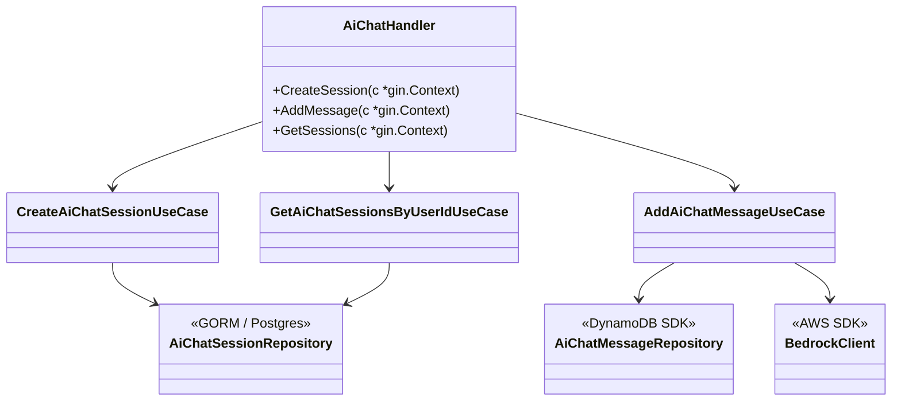
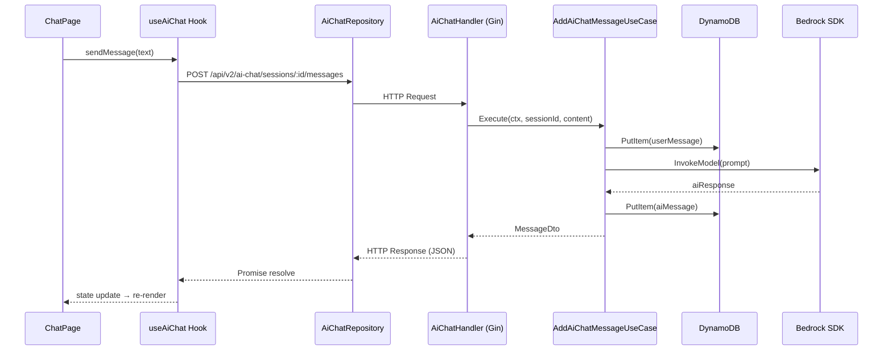
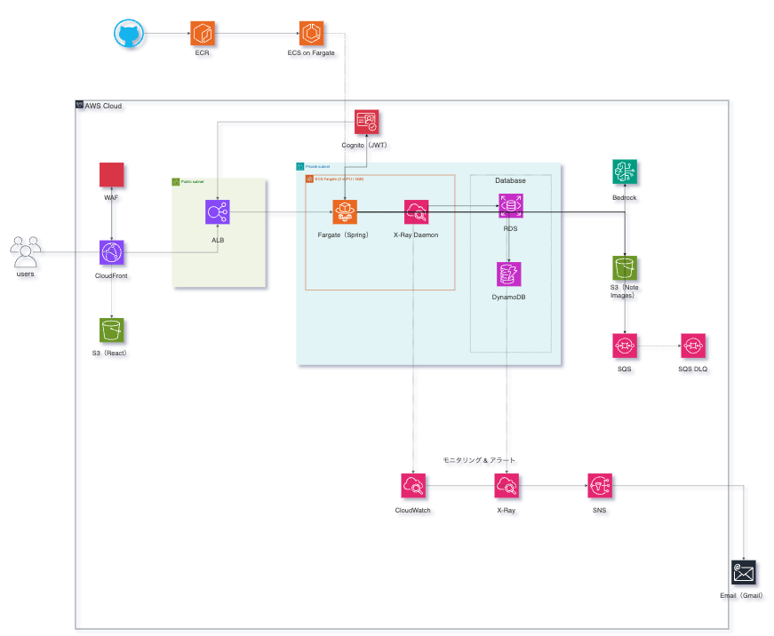
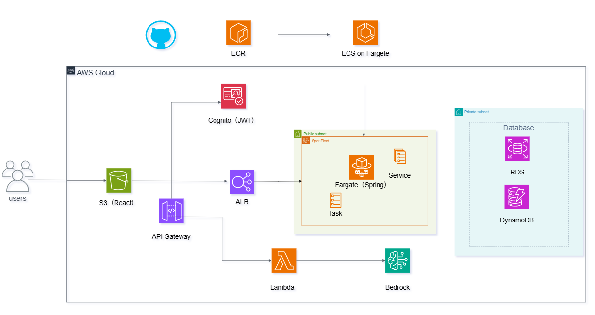
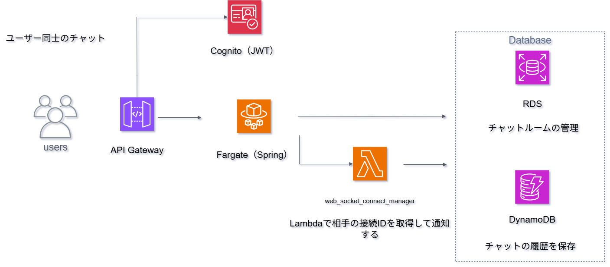
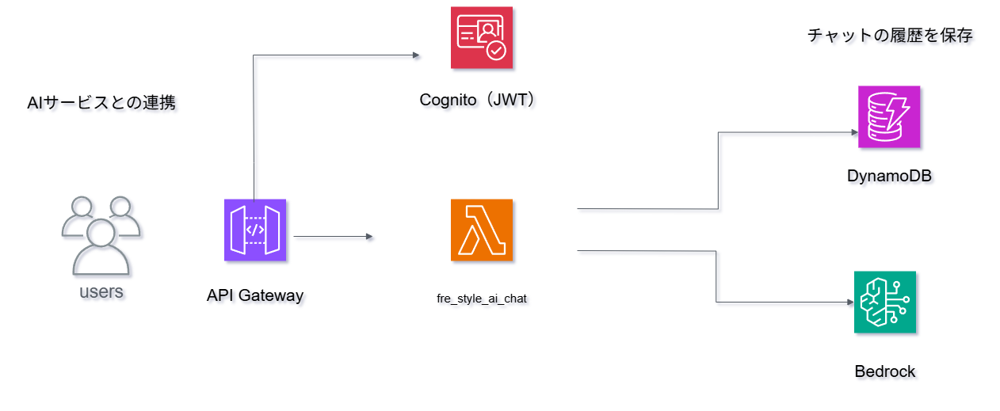
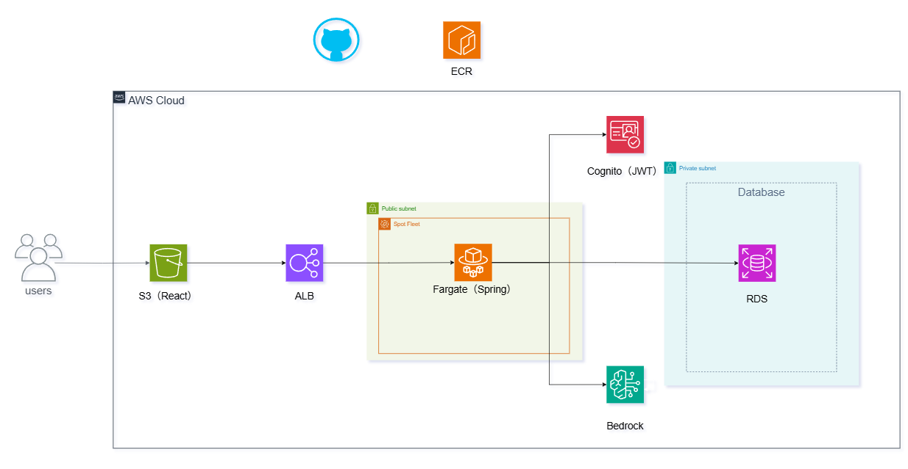

## FreStyle とは

**新卒 IT エンジニア向け統合研修プラットフォーム（B2B SaaS）**

開発の現場に入ったばかりの新卒エンジニアは、Box / Google Drive / PowerPoint / Notion / Slack / GitHub / 紙資料 …… と **散らばった研修ツールを行き来するだけで疲弊**してしまいがちです。FreStyle は、企業のメンター（教育担当エンジニア）が作った教材・問題集・コーディング課題・ビジネスコミュニケーション練習を **1 つのプラットフォーム上に集約**し、新卒が "学ぶことそのもの" に集中できる環境を提供します。

## なぜ作るのか（プロダクトの意義）

- **ツール散乱を解消**: 教材・解答・進捗・コミュニケーション練習が 1 ヶ所にまとまる
- **メンターのナレッジを資産化**: 各社の教育担当が時間をかけて作ったスライドや手順書を、再利用可能な構造化教材に変える
- **シングルタスク化**: 新卒は「アプリを切り替える」「資料を探す」コストをゼロにし、開発・問題演習・写経・実行を 1 画面で完結
- **早期戦力化を支援**: Git/Git Flow、社内で使うプログラミング言語、コーディング規約、業務上のコミュニケーションを実際にやって覚える設計

## ロール

| ロール | 例 | できること |
|---|---|---|
| **SuperAdmin** | FreStyle 運営側 | 顧客企業の登録、CompanyAdmin の招待、課金管理、横断監査 |
| **CompanyAdmin** (メンター) | 各社の教育担当エンジニア | 自社の教材・問題・解答 CRUD、自社新卒の招待、進捗ダッシュボード |
| **Trainee** (新卒) | 各社の新卒エンジニア | 自社の教材で学習・問題演習・コード実行・ビジネスコミュニケーション練習 |

## 機能（既存 → MVP → 拡張）

### 既存機能（残しつつ研修プラットフォームに統合）
- AI ロールプレイによる **ビジネスコミュニケーション練習**（顧客折衝・シニアとの対話など 12 種シナリオ）
- 5 軸評価 + IT 新卒向けサブ基準（論理的構成・配慮・要約・提案・質問傾聴）
- スコア履歴・ノート・週次チャレンジ
- → 上記は **「ビジネスコミュニケーション研修」モジュール**として、新卒研修コースの一部に組み込み可能

### Phase 0（マルチテナント基盤化）
- 「会社」概念を導入し、データを企業単位で完全分離（B2B SaaS 化）
- ロールを `super-admin` / `company-admin` / `trainee` の 3 階に整理
- **会社のオンボーディングは申請ベース**: 顧客企業が利用申請 → SuperAdmin（FreStyle 運営）が承認 → 初代 CompanyAdmin（メンター）招待

### Phase 1（研修プラットフォーム化 = MVP、進行中）
- **コース → セクション → レッスン**の 3 階層教材
- MVP のレッスン種別: **Markdown 教材 / 4 択クイズ / 〇× クイズ**
- メンター（CompanyAdmin）が教材を作成、新卒（Trainee）が消費
- 進捗トラッキング + メンター向けチームダッシュボード
- 既存のコミュニケーション練習も "Lesson type=communication" として組み込み可能

### Phase 2 以降
- ブラウザ内コード実行サンドボックス（paiza ライク、**最初から多言語対応** = Python / JavaScript / TypeScript / Java / Go）
- 写経モード（メンターのお手本コードを写す → 自動採点）
- AI 採点（記述式回答・コードレビューを Bedrock で評価）
- 認定証発行、SCORM/xAPI 互換、SSO（SAML/OIDC）

詳細は [docs/architecture/saas-vision.md](./docs/architecture/saas-vision.md) を参照。

## 対象顧客

**自社開発をしている企業**を主たるターゲットとします。

- 自社プロダクトを開発しており、新卒・中途エンジニアを毎年複数名採用する Web / SaaS / 事業会社
- 社内に教育担当エンジニア（メンター）を確保できる規模の開発組織
- 「研修資料は Box / Drive / Notion / Slack に散らばっていて見つからない」という課題感を持つ教育担当者
- → SIer の元請け企業など、外部委託主体の組織は当面ターゲット外（OJT モデルとマッチしないため）

## オンボーディング（B2B 申請承認フロー）

```
顧客企業（教育担当）            FreStyle 運営 (SuperAdmin)         新卒 (Trainee)
       │                              │                                │
       │ 1. 利用申請（フォーム）           │                                │
       │─────────────────────────────►│                                │
       │                              │ 2. 承認・会社レコード作成              │
       │                              │ 3. 初代 CompanyAdmin 招待メール送信   │
       │ ◄────────────────────────────│                                │
       │ 4. CompanyAdmin として初回ログイン  │                                │
       │ 5. 教材を作成・新卒メンバーを招待     │                                │
       │─────────────────────────────────────────────────────────────►│
       │                              │                                │ 6. ログインして学習開始
```

- セルフサインアップは Phase 3 以降に検討
- 当面は SuperAdmin が手動承認することで、テナント品質と契約管理を担保

---

## デプロイURL（料金の関係上サービスを停止する可能性があります）

[https://normanblog.com](https://normanblog.com)

---

## 使用技術

<h3>Frontend</h3>
<a href="https://skillicons.dev">
  
</a>

<h3>Backend</h3>
<a href="https://skillicons.dev">
  
</a>

> バックエンド (Go / Gin / GORM) は `backend/` 配下で運用。
> 旧 Spring Boot 実装は廃止済み（移行完了後に削除）。

<h3>Infrastructure</h3>
<a href="https://skillicons.dev">
  
</a>

<h3>Database</h3>
<a href="https://skillicons.dev">
  
</a>

<h3>CI/CD</h3>
<a href="https://skillicons.dev">
  
</a>

### AWS サービス詳細

| カテゴリ | サービス | 用途 |
|---------|----------|------|
| **Compute** | ECS (Fargate), ECR | コンテナ実行・イメージ管理 |
| **Networking** | CloudFront, ALB, Route 53 | CDN・ロードバランシング・DNS |
| **Database** | RDS (PostgreSQL 16), DynamoDB | リレーショナルDB（GORM 経由）・NoSQL |
| **Storage** | S3 | フロントエンドホスティング・画像保存 |
| **Auth** | Cognito | JWT認証 (HttpOnly Cookie) |
| **AI** | Bedrock | AIチャット（コミュニケーションスコア評価） |
| **Messaging** | SQS | 非同期レポート生成 |
| **Security** | WAF | XSS・SQLi・DDoS防御・レート制限 |
| **Monitoring** | CloudWatch, X-Ray, SNS | メトリクス・分散トレーシング・エラー通知 |
| **CI/CD** | GitHub Actions | 自動テスト・デプロイ |

---

## Architecture Highlights（工夫した点）

### ① WebSocket と HTTP API の構成を用途別に完全分離
- **WebSocket**：API Gateway + Lambda + DynamoDB
- **HTTP（Rest API）**：ECS（Fargate） + Go (Gin)

リアルタイム性と低コストを優先した WebSocket と、安定稼働・複雑処理に適した HTTP API を分離し、性能・コスト・可用性の最適化を実現。

### ② JWT（HttpOnly Cookie）× Cognito の安全な認証設計
- JWT を HttpOnly Cookie に保存（XSS 対策）
- アクセストークンの有効期間を短くしリフレッシュトークンで再発行
- OIDC & JWK を活用した堅牢な認証フロー
- OIDC 経由でも当該アプリ経由でも同一ユーザーとして認識
- Go 側は Gin の middleware で JWT 検証（`golang-jwt/jwt` + AWS Cognito JWKS）を実装

### ③ CloudFront によるグローバル最適化と HTTPS 化
- 高速配信（CDN）
- OIDC と組み合わせてセキュアなフロント構成
- Cognito / OIDC ログインで HTTPS が必須なため採用

### ④ Spring Boot → Go (Gin + GORM) 移行完了

**2026 年 4 月 27 日**: 全 28 機能（Phase 1〜28）を Go (Gin + GORM) に移植し、Spring Boot 実装を廃止しました。フロントエンドは `/api/v2/*` 経由で Go バックエンドのみと通信します。

#### Go に移行した結果

| 観点 | Spring Boot (旧、廃止済み) | Go + Gin (現行) |
|---|---|---|
| ECS Fargate スペック | 2 vCPU / 4 GB（JVM オーバーヘッド分） | 0.25 vCPU / 0.5 GB（最小） |
| Fargate コスト見込み | ~$2.40/日 | ~$0.30/日（**約 80% 削減**） |
| 起動時間 | 数十秒（JVM warmup） | サブ秒 |
| バイナリサイズ | JRE + jar 約 200 MB+ | distroless + static binary 約 30 MB |
| 並行処理 | スレッドプール | goroutine（軽量） |

#### 移行手順（履歴）

- Phase 0: `backend/` 基盤（Gin + GORM + クリーンアーキ + Dockerfile + CI）
- Phase 1〜28: 機能（controller 単位）ごとに独立 issue / PR / squash merge
- 最終 cutover: フロントエンド repository を `/api/*` → `/api/v2/*` に一括切替、Spring Boot コード (`FreStyle/`) を完全削除

#### Go バックエンドのクリーンアーキテクチャ

Spring Boot 時代に確立した依存方向ルールを Go 側にも忠実に持ち込んでいます。

```text
┌────────────────────────────────────────────────────────────┐
│                  Presentation Layer                        │
│   handler (Gin)                                            │
└────────────────────────────────────────────────────────────┘
                       ↓
┌────────────────────────────────────────────────────────────┐
│                  Application Layer                         │
│   usecase（1 ユースケース = 1 ファイル）                    │
└────────────────────────────────────────────────────────────┘
                       ↓
┌────────────────────────────────────────────────────────────┐
│                    Domain Layer                            │
│   domain（純粋なドメイン構造体・ロジック）                   │
└────────────────────────────────────────────────────────────┘
                       ↓
┌────────────────────────────────────────────────────────────┐
│                Infrastructure Layer                        │
│   repository (GORM) / infra (Cognito / S3 / Bedrock SDK)   │
└────────────────────────────────────────────────────────────┘
```

ディレクトリ:

```
backend/
├── cmd/server/          エントリーポイント (main.go)
├── internal/
│   ├── handler/         HTTP ハンドラ層 (Gin)
│   ├── usecase/         ユースケース層 (1 ユースケース 1 ファイル)
│   ├── repository/      リポジトリ層 (GORM)
│   ├── domain/          ドメインモデル (純粋ドメイン構造体)
│   └── infra/
│       ├── config/      環境変数ロード
│       └── database/    GORM + PostgreSQL 接続
├── Dockerfile           multi-stage / distroless / static binary
└── go.mod
```

詳細な層責務・パッケージ依存関係・テスト戦略は [`docs/ARCHITECTURE.md`](./docs/ARCHITECTURE.md) を参照。

#### 層構成（フロントエンド）

バックエンドと同じ発想でフロントエンドもレイヤー化しています。

```text
Page (画面)  →  Hook (Application)  →  Repository (axios)
  ↓
Component (Presentational)
```

#### 依存関係図（AI チャット機能 - Go 移植版の例）


```mermaid
classDiagram
    class AiChatHandler {
      +CreateSession(c *gin.Context)
      +AddMessage(c *gin.Context)
      +GetSessions(c *gin.Context)
    }
    class CreateAiChatSessionUseCase
    class AddAiChatMessageUseCase
    class GetAiChatSessionsByUserIdUseCase
    class AiChatSessionRepository {
      <<GORM / Postgres>>
    }
    class AiChatMessageRepository {
      <<DynamoDB SDK>>
    }
    class BedrockClient {
      <<AWS SDK>>
    }

    AiChatHandler --> CreateAiChatSessionUseCase
    AiChatHandler --> AddAiChatMessageUseCase
    AiChatHandler --> GetAiChatSessionsByUserIdUseCase

    CreateAiChatSessionUseCase --> AiChatSessionRepository
    AddAiChatMessageUseCase --> AiChatMessageRepository
    AddAiChatMessageUseCase --> BedrockClient
    GetAiChatSessionsByUserIdUseCase --> AiChatSessionRepository
```

#### データフロー: AI チャットへメッセージを送る（Go 版）


```mermaid
sequenceDiagram
    participant FE as ChatPage
    participant Hook as useAiChat Hook
    participant Repo as AiChatRepository
    participant H as AiChatHandler (Gin)
    participant UC as AddAiChatMessageUseCase
    participant DDB as DynamoDB
    participant Bed as Bedrock SDK

    FE->>Hook: sendMessage(text)
    Hook->>Repo: POST /api/v2/ai-chat/sessions/:id/messages
    Repo->>H: HTTP Request
    H->>UC: Execute(ctx, sessionId, content)
    UC->>DDB: PutItem(userMessage)
    UC->>Bed: InvokeModel(prompt)
    Bed-->>UC: aiResponse
    UC->>DDB: PutItem(aiMessage)
    UC-->>H: MessageDto
    H-->>Repo: HTTP Response (JSON)
    Repo-->>Hook: Promise resolve
    Hook-->>FE: state update → re-render
```

### ⑤ 初心者向けUIコンポーネントライブラリ

新卒エンジニアが迷わず使えるよう、`frontend/src/components/ui/` に共通UIコンポーネント群を整備しています。

| コンポーネント | 用途 |
|---|---|
| `PageIntro` | 全画面統一のページヘッダー |
| `FirstTimeWelcome` | 初回訪問時の導入カード（localStorage永続化） |
| `GlossaryTerm` | 専門用語の下線表示＋クリックで用語解説 |
| `HelpTooltip` | 「?」アイコン付きの補足説明 |
| `StepIndicator` | 多段階操作の進行状況可視化 |
| `GuidedHint` | 閉じるボタン付き初心者向けヒント |
| `ActionCard` | Link/Button両対応の強調CTAカード |

専門用語（5軸評価・論理的構成力・練習モードなど）の定義は `frontend/src/constants/glossary.ts` に集約。

---

## 苦労した点・学び
- WebSocket を ECS で保持するか、サーバーレスにするかの検討 → コスト / 工数削減 / レイテンシから Lambda + APIGW に決定
- Spring Security の JWT / JWK / Cookie 設計（Go 移行後は Gin middleware で再実装）
- ALB の TLS Termination と ECS の Backend 構成
- Spring Boot の JVM オーバーヘッドにより Fargate 2 vCPU / 4 GB を要し、ランニングコストが嵩んでいた → Go (Gin + GORM) に置き換えて 0.25 vCPU / 0.5 GB へ縮退する設計に切替
- 既存資産を捨てない移行戦略の設計（path-based routing による Spring Boot / Go 並行運用）

---

## 技術選定理由（HTTP API / ECS Fargate / Go）

1. **Go (Gin + GORM)** で書き直すことでコンテナ要求リソースを最小化
   - JVM が要求する 2 vCPU / 4 GB → 0.25 vCPU / 0.5 GB へ
   - 起動時間サブ秒、distroless で 30 MB 級の static binary
   - goroutine による軽量並行処理

2. **ECS Fargate** で Docker 化したアプリを安定稼働
   - サーバープロビジョニング不要 / OS 管理不要
   - 旧 Spring Boot 版から Go 版への切替は ECS Service 単位で blue/green に近い運用が可能

3. **ALB と連携した柔軟なルーティング**
   - ホストベースルーティングで [BeStyle](https://normanblog.com) にも同じロードバランサーを使用しコスト削減
   - ヘルスチェックは Go 側で `/api/v2/health` を提供し ALB Target Group が定期チェック

4. **Blue/Green デプロイ**
   - CodeDeploy と連携
   - 新バージョンのヘルスチェック後に切替
   - 即時ロールバック可能

---

## 技術選定理由（WebSocket / サーバーレス構成）

1. コスト最適化（従量課金）  
   ECS 常時稼働より大幅に低コスト。

2. 低レイテンシ & シンプルな処理  
   Lambda → DynamoDB の最短経路。

3. サーバーレスで構成統一
   - フルマネージド
   - 自動スケーリング
   - 運用負荷最小

---

## AWSアーキテクチャ構成図

### 現在のAWS全体構成図



### 旧AWS構成図

<details>
<summary>変更前の構成図（クリックで展開）</summary>

#### AWS全体構成図（変更前）


#### ユーザー同士のチャット（変更前）


#### AIとユーザーのチャット（変更前）


#### 変更後のAWSアーキテクチャー図


</details>

### なぜアーキテクチャーを変えたのか
1. AIへのフィードバックにユーザーがより自分の性格を把握できるように複雑なクエリを実行する必要があったのでDynamoDBではサービス層が複雑になるのでRDSに変更をした
2. Lambda + API Gatewayではトラフィック量が多くなったときに捌きにくいこと
3. 機能の拡張性を踏まえたらECS一本で使用したほうがSQSなどを設定したときに工数を割くことができる

---

## 今年の目標

### 技術・資格
- AWS SAP、CKA、CKAD
- GO言語でgRPC通信でサービス間接続

### 機能拡張
- 音声チャット
- Polly による AI 音声解答可能
- SageMakerを使用をしチャットの内容をクラスタリングで感情分析をすること
- 未読、既読、プッシュ通知機能の作成でSQS、SNSを使用をする
- チャット以外にもパーソナリティーが見えるシステムを作成する

---

## ローカル開発環境セットアップ

### バックエンド (Go) — `backend/`

```bash
cd backend

# 1) 依存解決
go mod tidy

# 2) PostgreSQL 接続情報を環境変数に
export DB_HOST=localhost
export DB_PORT=5432
export DB_USER=postgres
export DB_PASSWORD=<password>
export DB_NAME=fre_style
export DB_SSLMODE=disable
export PORT=8080

# 3) 起動
go run ./cmd/server

# 4) 動作確認
curl http://localhost:8080/
# => {"message":"FreStyle Go backend (Phase 0 bootstrap)"}
```

Docker でビルドする場合:

```bash
cd backend
docker build -t frestyle-backend:dev .
docker run --rm -p 8080:8080 \
  -e DB_HOST=host.docker.internal \
  -e DB_USER=postgres -e DB_PASSWORD=<password> \
  -e DB_NAME=fre_style -e DB_SSLMODE=disable \
  frestyle-backend:dev
```

### フロントエンド

```bash
# 1. リポジトリをクローンして frontend ディレクトリに移動
cd frontend

# 2. 依存パッケージをインストール
npm install

# 3. 動作確認
npm run dev

# 4. Tailwind CSS が動作しない場合
npm uninstall tailwindcss
npm install -D tailwindcss@バージョン指定
npx tailwindcss init -p
```

---

## 本番環境DBマイグレーション

本番環境（AWS RDS PostgreSQL）にデプロイする際、スキーマの更新が必要な場合はマイグレーション SQL を実行してください。

### マイグレーション手順

```bash
# 1. AWS RDS (PostgreSQL) に踏み台 EC2 経由で接続
ssh -L 5432:<RDS_ENDPOINT>:5432 ec2-user@<BASTION>
psql -h localhost -U postgres -d fre_style

# 2. マイグレーション SQL を実行
\i backend/migrations/001_add_practice_mode_support.sql

# 3. 確認
\d ai_chat_sessions
SELECT COUNT(*) FROM practice_scenarios;
```

### マイグレーション一覧

| ファイル名 | 実行日 | 内容 |
|-----------|--------|------|
| `001_add_practice_mode_support.sql` | 2026-02-12 | 練習モード機能追加（`ai_chat_sessions` に `session_type`, `scenario_id` カラム追加、`practice_scenarios` テーブル作成、初期データ 12 件投入） |

**注意**: マイグレーションは冪等性があり、複数回実行しても安全です（`IF NOT EXISTS`, `ON CONFLICT DO NOTHING` を使用）。

GORM 側の AutoMigrate は本番では使わず、明示的な SQL で運用します（破壊的変更の検知漏れを防ぐため）。

---

## 開発フロー / 貢献ガイド

本プロジェクトは以下の運用ルールで開発されています。

### ブランチ運用

1. Issue を起票（日本語で目的・完了条件を明記）
2. ブランチを切る（`feat/*` / `fix/*` / `refactor/*` / `docs/*` / `test/*`）
3. 作業 → コミット（コミットメッセージは日本語）
4. PR 作成（タイトル・本文とも日本語）
5. **CodeRabbit によるコードレビューを待つ**
6. CodeRabbit 指摘に対応
7. **squash merge**（main への直接コミット禁止、ブランチ保護設定済み）

### コーディング規約（要点）

- **クリーンアーキテクチャ**: handler → usecase → repository → domain（Go）/ Controller → UseCase → Service / Repository → Entity（Spring Boot）の依存方向を厳守。詳細は [`docs/ARCHITECTURE.md`](./docs/ARCHITECTURE.md)
- **1 UseCase = 1 ビジネスルール**: 新規機能追加時は usecase ファイルを新規作成し、肥大化させない
- **DTO ↔ Domain 変換**: 1 箇所に集約。handler / usecase で直接変換しない
- **テスト必須**: 新規追加コードには必ず単体テストを付ける
- **日本語**: PR / Issue / コミットメッセージ / コメントは日本語、識別子は英語

### テスト

#### バックエンド (Go)

```bash
cd backend
go vet ./...
go test ./...
```

- 標準 `testing` パッケージ + `github.com/stretchr/testify`（順次導入）
- usecase: 依存をインターフェイスとしてモック化した単体テスト
- repository: テスト用 PostgreSQL コンテナまたは sqlite による統合テスト
- handler: `httptest.NewRecorder` + `gin.New()` でルータごと検証

#### フロントエンド

```bash
cd frontend
npm test
```

- Vitest + React Testing Library
- 慣習: `vi.stubGlobal('localStorage', createMockStorage())` で localStorage をスタブ、`fireEvent` でイベント発火

---

## ライセンス

MIT License
