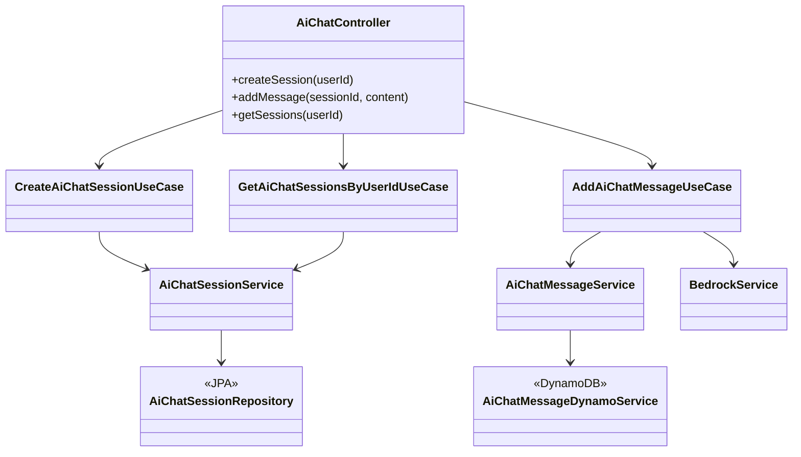
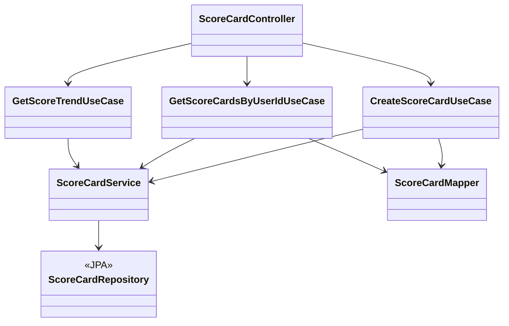
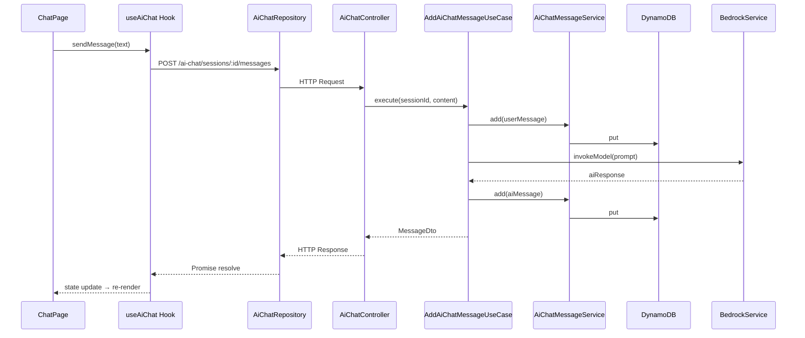

## FreStyleとは

## ターゲットユーザー

**新卒ITエンジニアのためのビジネスコミュニケーション練習アプリ**

- **顧客折衝**: 障害報告、要件変更の影響説明、見積もり交渉など、顧客との難しい場面を想定したケーススタディで学べます
- **シニアエンジニアとの対話**: 設計レビューでの意見対立、コードレビューのフィードバック対応、技術負債の改善提案など、経験豊富なエンジニアとのコミュニケーションスキルを磨けます
- **実践的なシナリオ**: AIがロールプレイ相手となり、実務で遭遇する12種類のビジネスシーンを体験できます
- **5軸評価 + IT新卒向けサブ基準**: 論理的構成力（報連相の構造化）、配慮表現（敬語の正確さ）、要約力（技術説明の平易化）、提案力（エスカレーション判断力）、質問・傾聴力（要件確認の網羅性）で評価

技術スキルだけでなく、ビジネスコミュニケーション能力も身につけたい新卒エンジニアを支援します。

---

## デプロイURL（料金の関係上サービスを停止する可能性があります）

[https://normanblog.com](https://normanblog.com)

---

## 使用技術

<h3>Frontend</h3>
<a href="https://skillicons.dev">
  
</a>

<h3>Backend</h3>
<a href="https://skillicons.dev">
  
</a>

<h3>Infrastructure</h3>
<a href="https://skillicons.dev">
  
</a>

<h3>Database</h3>
<a href="https://skillicons.dev">
  
</a>

<h3>CI/CD</h3>
<a href="https://skillicons.dev">
  
</a>

### AWS サービス詳細

| カテゴリ | サービス | 用途 |
|---------|----------|------|
| **Compute** | ECS (Fargate), ECR | コンテナ実行・イメージ管理 |
| **Networking** | CloudFront, ALB, Route 53 | CDN・ロードバランシング・DNS |
| **Database** | RDS (MariaDB), DynamoDB | リレーショナルDB・NoSQL |
| **Storage** | S3 | フロントエンドホスティング・画像保存 |
| **Auth** | Cognito | JWT認証 (HttpOnly Cookie) |
| **AI** | Bedrock | AIチャット（コミュニケーションスコア評価） |
| **Messaging** | SQS | 非同期レポート生成 |
| **Security** | WAF | XSS・SQLi・DDoS防御・レート制限 |
| **Monitoring** | CloudWatch, X-Ray, SNS | メトリクス・分散トレーシング・エラー通知 |
| **CI/CD** | GitHub Actions | 自動テスト・デプロイ |

---

## Architecture Highlights（工夫した点）

### ① WebSocket と HTTP API の構成を用途別に完全分離
- **WebSocket**：API Gateway + Lambda + DynamoDB  
- **HTTP（Rest API）**：ECS（Fargate） + Spring Boot  

リアルタイム性と低コストを優先した WebSocket と、安定稼働・複雑処理に適した HTTP API を分離し、性能・コスト・可用性の最適化を実現。

### ② JWT（HttpOnly Cookie）× Spring Security の安全な認証設計
- JWT を HttpOnly Cookie に保存（XSS 対策）
- アクセストークンの有効期間を短くしリフレッシュトークンで再発行をする
- OIDC & JWK を活用した堅牢な認証フロー
- OIDC経由でも当該アプリ経由でも同一ユーザーとして認識

### ③ CloudFront によるグローバル最適化と HTTPS 化
- 高速配信（CDN）
- OIDC と組み合わせてセキュアなフロント構成
- Cognito/OIDCログインを使用しているのでHTTPSの必須になるので採用した

### ④ クリーンアーキテクチャの適用による保守性向上
**Phase 1-3リファクタリング完了** (2026年2月)

バックエンドコードをクリーンアーキテクチャに基づいて全面リファクタリングし、保守性・テスタビリティ・可読性を大幅に向上させました。

詳細な層責務・クラス依存関係・テスト戦略は [`docs/ARCHITECTURE.md`](./docs/ARCHITECTURE.md) を一次情報として参照してください。

#### 実装内容
- **Mapper層**: DTO↔Entity変換を一箇所に集約
- **UseCase層**: ビジネスロジックをController層から分離（87クラス）
- **依存性逆転の原則**: Controller → UseCase → Service/Repository の明確な依存関係を確立
- **単一責任の原則**: 各クラスの責務を明確化し、1クラス1責務を徹底

#### リファクタリング対象
- **Phase 1**: 練習モード機能（PracticeScenarioService → 3 UseCases）
- **Phase 2**: AI Chat機能（AiChatSessionService/AiChatMessageService → 10 UseCases）
- **Phase 3**: ScoreCard機能（ScoreCardService → 3 UseCases + Mapper）

#### 成果
- コード行数: **+1,849行追加 / -377行削除**
- テスタビリティ向上: モック化が容易な設計に
- 日本語コメント充実: 各クラスの役割・責務を明記

#### 層構成（バックエンド）

```
┌────────────────────────────────────────────────────────────┐
│                  Presentation Layer                        │
│   Controller（REST / WebSocket）                           │
└────────────────────────────────────────────────────────────┘
                       ↓
┌────────────────────────────────────────────────────────────┐
│                  Application Layer                         │
│   UseCase（1 ユースケース = 1 クラス／87 クラス）            │
└────────────────────────────────────────────────────────────┘
                       ↓
┌────────────────────────────────────────────────────────────┐
│                    Domain Layer                            │
│   Service（ドメインロジック・外部統合） / Entity             │
└────────────────────────────────────────────────────────────┘
                       ↓
┌────────────────────────────────────────────────────────────┐
│                Infrastructure Layer                        │
│   Repository（JPA / DynamoDB / S3 / Bedrock）               │
└────────────────────────────────────────────────────────────┘
```

#### 層構成（フロントエンド）

バックエンドと同じ発想でフロントエンドもレイヤー化しています。

```
Page (画面)  →  Hook (Application)  →  Repository (axios)
  ↓
Component (Presentational)
```

#### クラス依存関係図（AI チャット機能）


```mermaid
classDiagram
    class AiChatController {
      +createSession(userId)
      +addMessage(sessionId, content)
      +getSessions(userId)
    }
    class CreateAiChatSessionUseCase
    class AddAiChatMessageUseCase
    class GetAiChatSessionsByUserIdUseCase
    class AiChatSessionService
    class AiChatMessageService
    class BedrockService
    class AiChatSessionRepository {
      <<JPA>>
    }
    class AiChatMessageDynamoService {
      <<DynamoDB>>
    }

    AiChatController --> CreateAiChatSessionUseCase
    AiChatController --> AddAiChatMessageUseCase
    AiChatController --> GetAiChatSessionsByUserIdUseCase

    CreateAiChatSessionUseCase --> AiChatSessionService
    AddAiChatMessageUseCase --> AiChatMessageService
    AddAiChatMessageUseCase --> BedrockService
    GetAiChatSessionsByUserIdUseCase --> AiChatSessionService

    AiChatSessionService --> AiChatSessionRepository
    AiChatMessageService --> AiChatMessageDynamoService
```

#### クラス依存関係図（スコア評価機能）


```mermaid
classDiagram
    class ScoreCardController
    class CreateScoreCardUseCase
    class GetScoreCardsByUserIdUseCase
    class GetScoreTrendUseCase
    class ScoreCardService
    class ScoreCardMapper
    class ScoreCardRepository {
      <<JPA>>
    }

    ScoreCardController --> CreateScoreCardUseCase
    ScoreCardController --> GetScoreCardsByUserIdUseCase
    ScoreCardController --> GetScoreTrendUseCase

    CreateScoreCardUseCase --> ScoreCardService
    CreateScoreCardUseCase --> ScoreCardMapper
    GetScoreCardsByUserIdUseCase --> ScoreCardService
    GetScoreCardsByUserIdUseCase --> ScoreCardMapper
    GetScoreTrendUseCase --> ScoreCardService

    ScoreCardService --> ScoreCardRepository
```

#### データフロー: AI チャットへメッセージを送る


```mermaid
sequenceDiagram
    participant FE as ChatPage
    participant Hook as useAiChat Hook
    participant Repo as AiChatRepository
    participant Ctrl as AiChatController
    participant UC as AddAiChatMessageUseCase
    participant Svc as AiChatMessageService
    participant DDB as DynamoDB
    participant Bed as BedrockService

    FE->>Hook: sendMessage(text)
    Hook->>Repo: POST /ai-chat/sessions/:id/messages
    Repo->>Ctrl: HTTP Request
    Ctrl->>UC: execute(sessionId, content)
    UC->>Svc: add(userMessage)
    Svc->>DDB: put
    UC->>Bed: invokeModel(prompt)
    Bed-->>UC: aiResponse
    UC->>Svc: add(aiMessage)
    Svc->>DDB: put
    UC-->>Ctrl: MessageDto
    Ctrl-->>Repo: HTTP Response
    Repo-->>Hook: Promise resolve
    Hook-->>FE: state update → re-render
```

### ⑤ 初心者向けUIコンポーネントライブラリ

新卒エンジニアが迷わず使えるよう、`frontend/src/components/ui/` に共通UIコンポーネント群を整備しています。

| コンポーネント | 用途 |
|---|---|
| `PageIntro` | 全画面統一のページヘッダー |
| `FirstTimeWelcome` | 初回訪問時の導入カード（localStorage永続化） |
| `GlossaryTerm` | 専門用語の下線表示＋クリックで用語解説 |
| `HelpTooltip` | 「?」アイコン付きの補足説明 |
| `StepIndicator` | 多段階操作の進行状況可視化 |
| `GuidedHint` | 閉じるボタン付き初心者向けヒント |
| `ActionCard` | Link/Button両対応の強調CTAカード |

専門用語（5軸評価・論理的構成力・練習モードなど）の定義は `frontend/src/constants/glossary.ts` に集約。

---

## 苦労した点・学び
- WebSocket を ECS で保持するか、サーバーレスにするかの検討 → コスト/工数削減/レイテンシから Lambda + APIGW に決定
- Spring Security の JWT / JWK / Cookie 設計
- ALB の TLS Termination と ECS の Backend 構成

---

## 技術選定理由（HTTP API / ECS Fargate）

1. Docker 化した Spring Boot を安定稼働させるため
   - サーバープロビジョニング不要
   - OS 管理不要

2. ALB と連携した柔軟なルーティング
   - ホストベースルーティングで[BeStyle](https://normanblog.com)にも同じロードバランサーを使用をしコスト削減をした
   - ヘルスチェックをしておりSpring Bootのactuatorでヘルスチェックのエンドポイントにアクセス

3. Blue/Green デプロイ
   - CodeDeploy と連携
   - 新バージョンのヘルスチェック後に切替
   - 即時ロールバック可能

---

## 技術選定理由（WebSocket / サーバーレス構成）

1. コスト最適化（従量課金）  
   ECS 常時稼働より大幅に低コスト。

2. 低レイテンシ & シンプルな処理  
   Lambda → DynamoDB の最短経路。

3. サーバーレスで構成統一
   - フルマネージド
   - 自動スケーリング
   - 運用負荷最小

---

## AWSアーキテクチャ構成図

### 現在のAWS全体構成図


### 旧AWS構成図

<details>
<summary>変更前の構成図（クリックで展開）</summary>

#### AWS全体構成図（変更前）


#### ユーザー同士のチャット（変更前）


#### AIとユーザーのチャット（変更前）


#### 変更後のAWSアーキテクチャー図


</details>

### なぜアーキテクチャーを変えたのか
1. AIへのフィードバックにユーザーがより自分の性格を把握できるように複雑なクエリを実行する必要があったのでDynamoDBではサービス層が複雑になるのでRDSに変更をした
2. Lambda + API Gatewayではトラフィック量が多くなったときに捌きにくいこと
3. 機能の拡張性を踏まえたらECS一本で使用したほうがSQSなどを設定したときに工数を割くことができる

---

## 今年の目標

### 技術・資格
- AWS SAP、CKA、CKAD
- GO言語でgRPC通信でサービス間接続

### 機能拡張
- 音声チャット
- Polly による AI 音声解答可能
- SageMakerを使用をしチャットの内容をクラスタリングで感情分析をすること
- 未読、既読、プッシュ通知機能の作成でSQS、SNSを使用をする
- チャット以外にもパーソナリティーが見えるシステムを作成する

---

## ローカル開発環境セットアップ

### バックエンド（Docker Compose）

```bash
# 1. 環境変数ファイルを作成（.env.example をコピーして値を設定）
cp .env.example .env

# 2. MariaDB + Spring Boot を起動
docker compose up -d --build

# 3. 動作確認
docker compose ps          # コンテナ状態確認
docker compose logs api    # Spring Boot ログ確認
```

MariaDB 11 がコンテナとして起動し、Spring Boot 起動時に `schema.sql` でテーブルが自動作成されます。

### フロントエンド

```bash
# 1. リポジトリをクローンして frontend ディレクトリに移動
cd frontend

# 2. 依存パッケージをインストール
npm install

# 3. 動作確認
npm run dev

# 4. Tailwind CSS が動作しない場合
npm uninstall tailwindcss
npm install -D tailwindcss@バージョン指定
npx tailwindcss init -p
```

---

## 本番環境DBマイグレーション

本番環境（AWS RDS）にデプロイする際、スキーマの更新が必要な場合はマイグレーションSQLを実行してください。

### マイグレーション手順

```bash
# 1. AWS RDSに接続
mysql -h <RDS_ENDPOINT> -u <DB_USER> -p <DB_NAME>

# 2. マイグレーションSQLを実行
source FreStyle/migrations/001_add_practice_mode_support.sql;

# 3. 確認
SHOW COLUMNS FROM ai_chat_sessions;
SELECT COUNT(*) FROM practice_scenarios;
```

### マイグレーション一覧

| ファイル名 | 実行日 | 内容 |
|-----------|--------|------|
| `001_add_practice_mode_support.sql` | 2026-02-12 | 練習モード機能追加（`ai_chat_sessions` に `session_type`, `scenario_id` カラム追加、`practice_scenarios` テーブル作成、初期データ12件投入） |

**注意**: マイグレーションは冪等性があり、複数回実行しても安全です（`IF NOT EXISTS`, `INSERT IGNORE` を使用）。

---

## 開発フロー / 貢献ガイド

本プロジェクトは以下の運用ルールで開発されています。

### ブランチ運用

1. Issue を起票（日本語で目的・完了条件を明記）
2. ブランチを切る（`feat/*` / `fix/*` / `refactor/*` / `docs/*` / `test/*`）
3. 作業 → コミット（コミットメッセージは日本語）
4. PR 作成（タイトル・本文とも日本語）
5. **CodeRabbit によるコードレビューを待つ**
6. CodeRabbit 指摘に対応
7. **squash merge**（main への直接コミット禁止、ブランチ保護設定済み）

### コーディング規約（要点）

- **クリーンアーキテクチャ**: Controller → UseCase → Service/Repository の依存方向を厳守。詳細は [`docs/ARCHITECTURE.md`](./docs/ARCHITECTURE.md)
- **1 UseCase = 1 ビジネスルール**: 新規機能追加時は Service に肥大化させず、UseCase クラスを新規作成
- **DTO ↔ Entity 変換**: Mapper に集約。Controller / UseCase で直接変換しない
- **テスト必須**: 新規追加コードには必ず単体テストを付ける
- **日本語**: PR / Issue / コミットメッセージ / コメントは日本語、識別子は英語

### テスト

#### バックエンド

```bash
cd FreStyle
./gradlew test
```

- JUnit 5 + Mockito + AssertJ
- UseCase: Mockito でモック化した単体テスト
- Service: 外部クライアントをモックした単体テスト
- Repository: `@DataJpaTest` + H2 インメモリDB による統合テスト
- Mapper: 純粋な変換ロジックの単体テスト

#### フロントエンド

```bash
cd frontend
npm test
```

- Vitest + React Testing Library
- 慣習: `vi.stubGlobal('localStorage', createMockStorage())` で localStorage をスタブ、`fireEvent` でイベント発火

---

## ライセンス

MIT License
