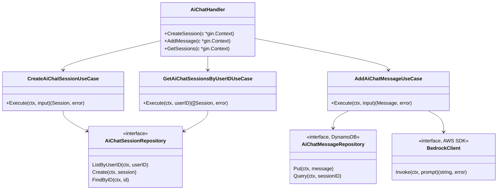
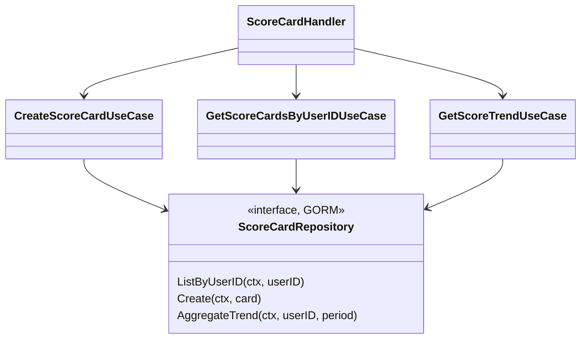
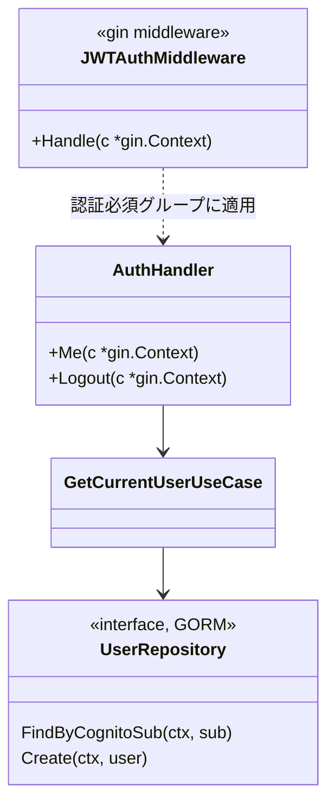
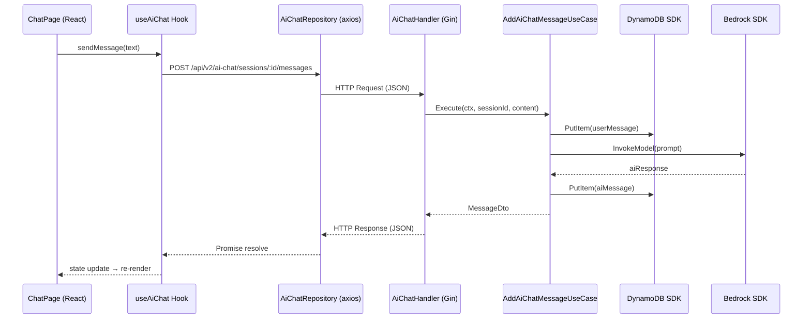
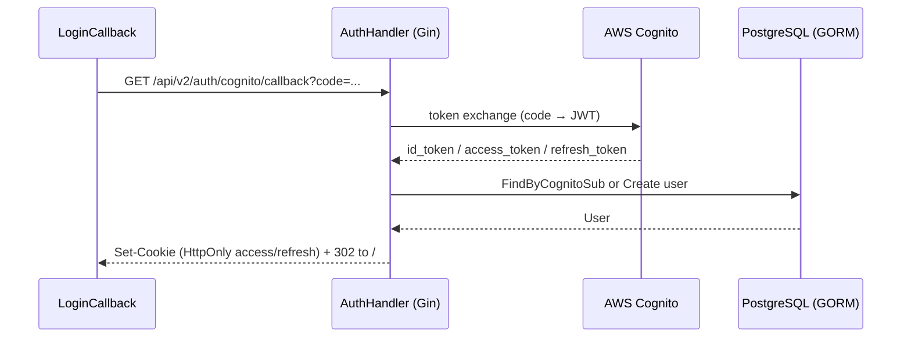

# FreStyle アーキテクチャ仕様書

本書は FreStyle プロジェクトにおけるクリーンアーキテクチャの適用方針、層ごとの責務、そしてクラス（Go 版ではパッケージ・型）間の依存関係を定義する **一次情報** です。

実装に迷ったとき・レビューで指針が必要なときは本書を根拠として判断してください。

> **移行ステータス（2026-04-27 現在）**
> 旧バックエンド: Spring Boot / Java（`FreStyle/` 配下、87 UseCase 完備）
> 新バックエンド: **Go (Gin + GORM)**（`backend/` 配下、Phase 0 で基盤整備済み、Phase 1 以降で機能を順次移植）
> 本書では Go 版を「正」とし、Spring Boot 版はリファレンス実装かつ移行中の並行運用として扱う。

---

## 目次

- [1. 設計原則](#1-設計原則)
- [2. 層構成（Go バックエンド）](#2-層構成go-バックエンド)
- [3. 層構成（フロントエンド）](#3-層構成フロントエンド)
- [4. パッケージ・型の依存関係図](#4-パッケージ型の依存関係図)
- [5. データフロー（代表的なユースケース）](#5-データフロー代表的なユースケース)
- [6. テスト戦略](#6-テスト戦略)
- [7. ディレクトリマップ](#7-ディレクトリマップ)
- [8. 変更時のチェックリスト](#8-変更時のチェックリスト)
- [9. Spring Boot 旧資産との関係](#9-spring-boot-旧資産との関係)

---

## 1. 設計原則

### 1.1 依存性逆転の原則 (Dependency Inversion Principle)

高レベルのモジュール（usecase）は、低レベルのモジュール（repository 実装）に**直接**依存せず、**インターフェース**を介して依存する。

Go では interface が言語機能として埋め込まれているので、`usecase` パッケージで interface を宣言し、`repository` パッケージで実装を提供する。

### 1.2 単一責任の原則 (Single Responsibility Principle)

- **1 usecase = 1 ビジネスルール**
- 複数の操作を一つの構造体に詰め込まない
- 例: `CreateAiChatSessionUseCase`, `AddAiChatMessageUseCase` は別ファイル・別構造体

### 1.3 関心の分離 (Separation of Concerns)

| 関心事 | 担当（Go） |
|---|---|
| HTTP / WebSocket プロトコル | `internal/handler` (Gin) |
| ビジネスロジックのオーケストレーション | `internal/usecase` |
| 永続化（GORM / DynamoDB SDK / S3 SDK / Bedrock SDK） | `internal/repository` および `internal/infra` |
| ドメインモデル・純粋ロジック | `internal/domain` |

### 1.4 テスタビリティ

すべての usecase は、依存リポジトリを interface 経由でモックして単体テスト可能でなければならない。

---

## 2. 層構成（Go バックエンド）

```text
┌────────────────────────────────────────────────────────────┐
│                  Presentation Layer                        │
│   handler (Gin)                                            │
│   github.com/.../backend/internal/handler                  │
└────────────────────────────────────────────────────────────┘
                           ↓ 呼び出し
┌────────────────────────────────────────────────────────────┐
│                  Application Layer                         │
│   usecase（1 ユースケース 1 ファイル / 1 構造体）             │
│   github.com/.../backend/internal/usecase                  │
└────────────────────────────────────────────────────────────┘
                           ↓ 呼び出し（interface 経由）
┌────────────────────────────────────────────────────────────┐
│                    Domain Layer                            │
│   domain（純粋なドメイン構造体・定数・ロジック）              │
│   github.com/.../backend/internal/domain                   │
└────────────────────────────────────────────────────────────┘
                           ↑ 参照のみ
┌────────────────────────────────────────────────────────────┐
│                Infrastructure Layer                        │
│   repository (GORM)                                        │
│   infra/database (PostgreSQL 接続)                         │
│   infra/config (環境変数)                                   │
│   後続 PR で追加: infra/dynamodb / infra/s3 / infra/bedrock  │
│   github.com/.../backend/internal/repository | infra       │
└────────────────────────────────────────────────────────────┘
```

### 2.1 各層の責務

| 層 | パッケージ | 責務 | 許される依存 |
|---|---|---|---|
| Presentation | `internal/handler` | HTTP/WS リクエスト受付、認証取得、usecase 呼び出し、JSON 返却 | `usecase`, `domain`, `handler/middleware` |
| Application | `internal/usecase` | ビジネスロジック。repository のオーケストレーション。usecase 内で interface 宣言 | `domain`, `repository`（interface のみ）|
| Domain | `internal/domain` | ドメイン構造体（GORM tag を含む）と純粋関数 | （層依存なし） |
| Infrastructure | `internal/repository`, `internal/infra/*` | 永続化、外部 API クライアント、設定 | `domain` |

### 2.2 禁止される依存

```text
❌ handler  → repository（直接呼び出し）
❌ usecase  → handler
❌ usecase  → repository の具象型に依存（interface のみ参照）
❌ repository → usecase
❌ domain   → 他のどの層
```

許可される輸入は Go の `internal/` パッケージ規約と上の matrix で物理的・論理的に縛る。

### 2.3 1 ユースケース 1 ファイル

- ❌ `aiChatService.AddMessage(...)` の中に「メッセージ追加 + Bedrock 呼び出し + DynamoDB put + Score 計算」が同居
- ⭕ `usecase/add_ai_chat_message_usecase.go` (`AddAiChatMessageUseCase`) として分離
- それぞれが固有の `Execute(ctx, input) (output, error)` シグネチャを持つ

---

## 3. 層構成（フロントエンド）

フロントエンドにも同じ発想でレイヤーを適用する。

```text
Page (画面)  →  Hook (Application)  →  Repository (axios) → HTTP
  ↓
Component (Presentational)
```

| 層 | ディレクトリ | 責務 |
|---|---|---|
| Page | `frontend/src/pages` | 画面コンポーネント。ビジネスロジックは書かない |
| Hook | `frontend/src/hooks` | 画面固有の状態管理・API 呼び出しを Hook にまとめる |
| Repository | `frontend/src/repositories` | axios の利用をここに集約。`/api/v2/*` (Go) と `/api/*` (Spring Boot 並行運用) を呼び分け |
| Component | `frontend/src/components` | プレゼンテーショナル。副作用なし |
| Store | `frontend/src/store` | Redux Toolkit slice。グローバル状態（auth など） |

---

## 4. パッケージ・型の依存関係図

### 4.1 AI チャット（Go 版）



### 4.2 スコア評価（Go 版）



### 4.3 認証（Go 版）



---

## 5. データフロー（代表的なユースケース）

### 5.1 AI チャットへメッセージを送る



### 5.2 ログイン（Cognito Hosted UI）



---

## 6. テスト戦略

### 6.1 バックエンド (Go)

| 層 | ツール | 戦略 |
|---|---|---|
| usecase | 標準 `testing` + (necessary に応じ `testify`) | 依存 interface をスタブで差し替え。各分岐をテーブル駆動でテスト |
| repository | テスト用 PostgreSQL container or sqlite | `gorm.Open()` を切替、CRUD 統合テスト |
| handler | `httptest.NewRecorder()` + `gin.New()` | ルータ単位で組み立てて HTTP 検証 |
| middleware | `httptest.NewRequest` でクッキー有無を制御 | 401 / 通過のテーブル駆動 |

**例: usecase テストのスケルトン**

```go
type stubUserRepo struct { user *domain.User; err error }
func (s *stubUserRepo) FindByCognitoSub(_ context.Context, _ string) (*domain.User, error) {
    return s.user, s.err
}

func TestGetCurrentUserUseCase_Found(t *testing.T) {
    uc := NewGetCurrentUserUseCase(&stubUserRepo{user: &domain.User{ID: 1}})
    got, err := uc.Execute(context.Background(), "abc")
    if err != nil || got.ID != 1 { t.Fatal("...") }
}
```

### 6.2 フロントエンド

| 対象 | ツール | 戦略 |
|---|---|---|
| Page / Component | Vitest + React Testing Library | render → role / text 検索でアクセシビリティ込み検証 |
| Hook | Vitest + `renderHook` | 状態遷移と副作用のテスト |
| Repository | Vitest + axios mock | リクエスト/レスポンスの形を検証 |

### 6.3 カバレッジ目標

新規追加コードは 80% 以上を目標とする。

---

## 7. ディレクトリマップ

### 7.1 Go バックエンド (`backend/`)

```
backend/
├── cmd/
│   └── server/main.go        # エントリーポイント
├── internal/
│   ├── handler/              # Gin ハンドラ・ルーティング (Spring の controller)
│   │   ├── router.go
│   │   ├── *_handler.go
│   │   └── middleware/       # JWT 認証等
│   ├── usecase/              # ユースケース (Spring の usecase)
│   │   ├── *_usecase.go
│   │   └── *_usecase_test.go
│   ├── repository/           # GORM 実装と interface (Spring の repository)
│   │   └── *_repository.go
│   ├── domain/               # ドメイン構造体 (Spring の entity)
│   │   └── *.go
│   └── infra/
│       ├── config/           # 環境変数ロード
│       └── database/         # GORM + PostgreSQL 接続
├── Dockerfile                # multi-stage / distroless
├── go.mod
└── README.md
```

### 7.2 フロントエンド (`frontend/`)

```
frontend/src/
├── pages/                    # 画面（Hook を使う）
├── hooks/                    # Application 層
├── repositories/             # axios 集約。/api/v2/* (Go) と /api/* (Spring Boot) を呼び分け
├── components/               # プレゼンテーショナル
├── store/                    # Redux Toolkit slice
└── utils/                    # ユーティリティ
```

---

## 8. 変更時のチェックリスト

新規機能を追加するときは以下を確認:

- [ ] `internal/handler/<feature>_handler.go` を新規作成
- [ ] `internal/usecase/<feature>_usecase.go` を新規作成（**1 ユースケース 1 構造体**）
- [ ] `internal/repository/<feature>_repository.go` で interface 宣言と GORM 実装を提供
- [ ] `internal/domain/<feature>.go` でドメイン構造体を定義（GORM tag）
- [ ] `internal/handler/router.go` でルーティングに追加（`/api/v2/<feature>` プレフィックス）
- [ ] `_test.go` で usecase 単体テストを書く
- [ ] `go vet ./...` / `go test ./...` 通過
- [ ] PR 本文に「Closes #<issue>」と移植元の Spring Boot Controller 名を記載

---

## 9. Spring Boot 旧資産との関係

### 9.1 並行運用ルール

- ALB の path-based routing で `/api/v2/*` を **Go ECS Service** に振り、`/api/*` を **Spring Boot ECS Service**（旧）に振る
- 同じ機能を Go で再実装している間は両系統が並走する
- Go 側で実装完了 → フロントエンド repository を `/api/v2/*` に切替 → 1 phase 終了

### 9.2 旧 Spring Boot 側の参照

`FreStyle/` 配下の旧コード（87 UseCase 含む）は **リファレンス実装** として保持。  
Go 移植時は Spring Boot の Controller / UseCase / Service / Repository を読んで仕様を確認してから Go 側に書き直す。

| Spring Boot | 対応する Go |
|---|---|
| `controller/AiChatController.java` | `internal/handler/ai_chat_handler.go` |
| `usecase/AddAiChatMessageUseCase.java` | `internal/usecase/add_ai_chat_message_usecase.go`（または同パッケージ内 type） |
| `service/AiChatSessionService.java` | `internal/usecase/*_usecase.go` に責務統合 or `internal/repository/*_repository.go` に分割 |
| `entity/AiChatSession.java` (JPA) | `internal/domain/ai_chat.go` (GORM) |
| `mapper/*Mapper.java` | usecase 内のシンプルな変換関数（必要時のみ） |

### 9.3 完全移行後

全 28 機能が Go に移植されたら:
- ALB の `/api/*` ルーティングを Go 側に切替
- Spring Boot ECS Service を destroy
- `FreStyle/` 配下を docs アーカイブとして移動 or 削除
- ECS Fargate スペックを `2 vCPU / 4 GB` → `0.25 vCPU / 0.5 GB` に縮退（コスト約 80% 削減）

このフェーズの進捗は GitHub Issues `Phase 1` 〜 `Phase 28` で管理。
