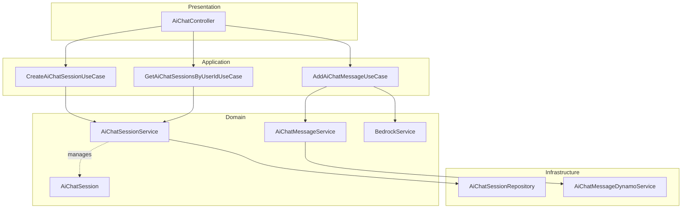
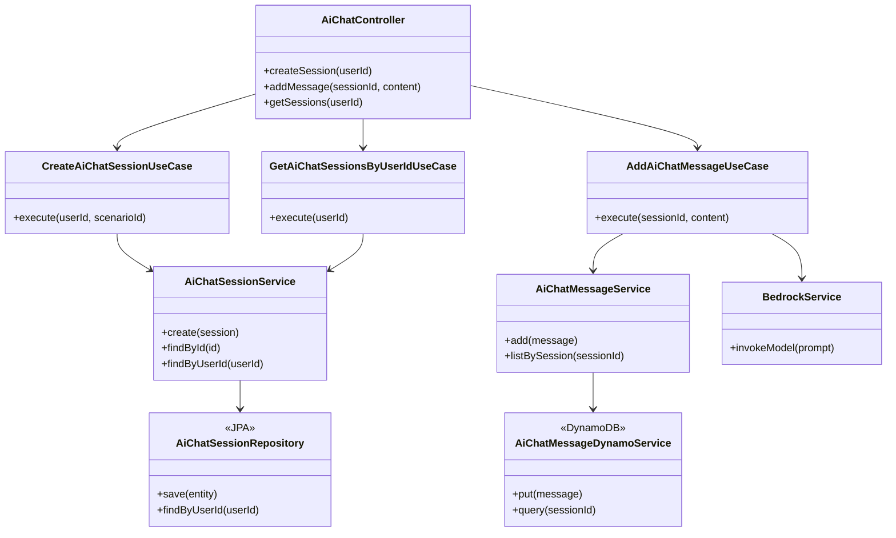
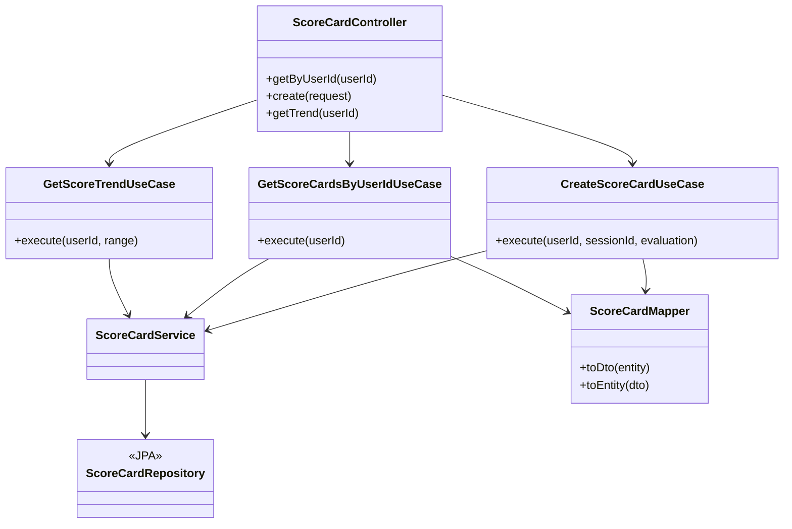
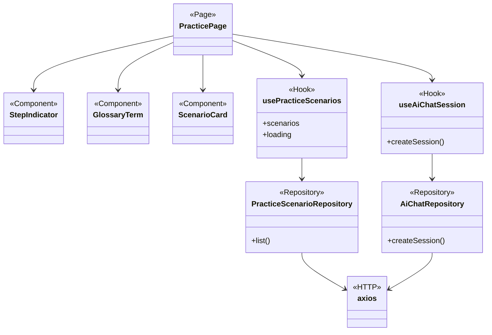
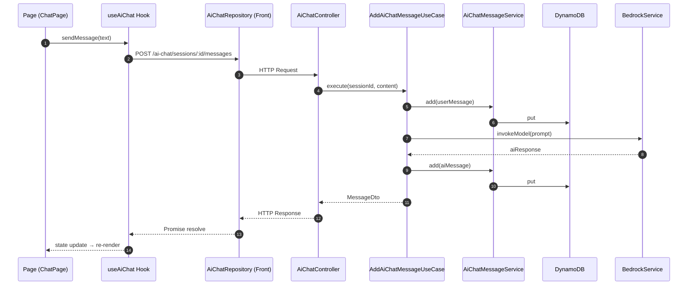
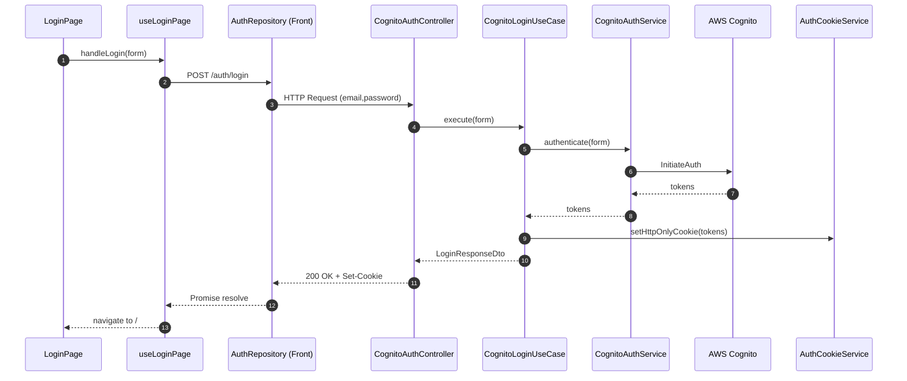

# FreStyle アーキテクチャ仕様書

本書は FreStyle プロジェクトにおけるクリーンアーキテクチャの適用方針、層ごとの責務、そしてクラス間の依存関係を定義する **一次情報** です。

実装に迷ったとき・レビューで指針が必要なときは本書を根拠として判断してください。

---

## 目次

- [1. 設計原則](#1-設計原則)
- [2. 層構成（バックエンド）](#2-層構成バックエンド)
- [3. 層構成（フロントエンド）](#3-層構成フロントエンド)
- [4. クラス依存関係図](#4-クラス依存関係図)
- [5. データフロー（代表的なユースケース）](#5-データフロー代表的なユースケース)
- [6. テスト戦略](#6-テスト戦略)
- [7. ディレクトリマップ](#7-ディレクトリマップ)
- [8. 変更時のチェックリスト](#8-変更時のチェックリスト)
- [参考: 過去のリファクタリング実績](#参考-過去のリファクタリング実績)

---

## 1. 設計原則

### 1.1 依存性逆転の原則 (Dependency Inversion Principle)

高レベルのモジュール（UseCase）は、低レベルのモジュール（Repository 実装）に依存しない。
どちらも抽象（インターフェース）に依存する。

### 1.2 単一責任の原則 (Single Responsibility Principle)

- **1 UseCase = 1 ビジネスルール**
- 複数の操作を一つのクラスに詰め込まない

### 1.3 関心の分離 (Separation of Concerns)

| 関心事 | 担当 |
|---|---|
| HTTP / WebSocket プロトコル | Controller |
| ビジネスロジックのオーケストレーション | UseCase |
| ドメインロジック・外部 API 統合 | Service |
| 永続化 | Repository |
| データ変換 | Mapper |

### 1.4 テスタビリティ

すべての UseCase は、**外部依存をモックして単体テスト可能**でなければならない。

---

## 2. 層構成（バックエンド）

```text
┌────────────────────────────────────────────────────────────┐
│                  Presentation Layer                        │
│   Controller (REST / WebSocket)                            │
│   com.example.FreStyle.controller                          │
└────────────────────────────────────────────────────────────┘
                           ↓ 呼び出し
┌────────────────────────────────────────────────────────────┐
│                  Application Layer                         │
│   UseCase (1 ユースケース 1 クラス)                         │
│   com.example.FreStyle.usecase                             │
└────────────────────────────────────────────────────────────┘
                           ↓ 呼び出し
┌────────────────────────────────────────────────────────────┐
│                    Domain Layer                            │
│   Service (ドメインロジック・外部統合)                       │
│   com.example.FreStyle.service                             │
│                                                            │
│   Entity (ドメインモデル)                                    │
│   com.example.FreStyle.entity                              │
└────────────────────────────────────────────────────────────┘
                           ↓ 呼び出し
┌────────────────────────────────────────────────────────────┐
│                Infrastructure Layer                        │
│   Repository (JPA / DynamoDB / S3 / Bedrock)               │
│   com.example.FreStyle.repository                          │
│   com.example.FreStyle.infrastructure                      │
└────────────────────────────────────────────────────────────┘
```

### 2.1 各層の責務

| 層 | パッケージ | 責務 | 許される依存 |
|---|---|---|---|
| Presentation | `controller` | HTTP/WS リクエスト受付、認証取得、UseCase 呼び出し、DTO 返却 | `usecase`, `dto`, `form`, `mapper` |
| Application | `usecase` | ビジネスロジック。Service/Repository のオーケストレーション | `service`, `repository`, `mapper`, `dto`, `entity`, `infrastructure`（※2.2.1 の例外規則参照） |
| Domain | `service` / `entity` | ドメインロジック、外部サービス統合、ドメインモデル | `repository`, `entity`, `infrastructure` |
| Infrastructure | `repository` / `infrastructure` / `config` | 永続化、外部 API クライアント、Spring Boot 設定 | `entity` |
| Shared | `dto` / `form` / `mapper` / `exception` / `utils` / `constant` | 横断的な型・変換・ユーティリティ | （層依存なし） |

### 2.2 禁止される依存

```text
❌ Controller → Service（直接呼び出し）
❌ Controller → Repository
❌ UseCase → Controller
❌ Service → UseCase
❌ Repository → Service
❌ Repository → UseCase
❌ Entity → 他の層
```

### 2.2.1 UseCase → Infrastructure（Gateway / Producer）に限って許容する例外

クリーンアーキテクチャの原理主義では UseCase は Domain のインターフェース経由で Infrastructure を呼ぶべきだが、本プロジェクトでは軽量化のため **非同期メッセージ送信（SQS Producer など）の Gateway クラスは `infrastructure` パッケージに配置したまま UseCase から直接利用することを許容**する。

対象:

- `com.example.FreStyle.infrastructure.SqsMessageProducer` — 例: [`EnqueueReportGenerationUseCase`](../FreStyle/src/main/java/com/example/FreStyle/usecase/EnqueueReportGenerationUseCase.java) から直接呼び出す

ルール:

- 例外として許容するのは **外向きの I/O のみ**（SQS 送信・メール送信・外部通知など、書き込み系のファイア＆フォーゲット）
- 許容するクラスには JavaDoc で「UseCaseから直接依存可」と明記する
- **DB 永続化は必ず Repository 経由**。`infrastructure` から直接DBを叩くのは禁止
- 将来的に依存先を差し替えたくなった時点で、Domain 層にインターフェースを切り直して依存性逆転に移行する（そのための拡張ポイント）

---

## 3. 層構成（フロントエンド）

フロントエンドもバックエンドと同じ発想でレイヤー化します。

```text
┌────────────────────────────────────────────────────────────┐
│              Presentation Layer                            │
│   Page (画面コンポーネント)                                  │
│   Component (プレゼンテーショナル)                           │
│   frontend/src/pages, frontend/src/components              │
└────────────────────────────────────────────────────────────┘
                           ↓
┌────────────────────────────────────────────────────────────┐
│              Application Layer                             │
│   Hook (画面固有の状態管理・API オーケストレーション)         │
│   Store (Redux Toolkit slice — グローバル状態のみ)          │
│   frontend/src/hooks, frontend/src/store                   │
└────────────────────────────────────────────────────────────┘
                           ↓
┌────────────────────────────────────────────────────────────┐
│              Infrastructure Layer                          │
│   Repository (axios ラッパー・HTTP API クライアント)         │
│   frontend/src/repositories                                │
└────────────────────────────────────────────────────────────┘
```

### 3.1 各層の責務

| 層 | ディレクトリ | 責務 |
|---|---|---|
| Page | `src/pages/` | ルーティングの先で表示する画面。Hook 呼び出しと Component 配置のみ |
| Component | `src/components/` | プレゼンテーショナルなパーツ。副作用を持たない |
| Hook | `src/hooks/` | 画面固有の状態・副作用。Repository を呼び出す |
| Store | `src/store/` | 全画面から参照されるグローバル状態（auth など）に限定 |
| Repository | `src/repositories/` | axios を直接使うのはここだけ。エンドポイント定義を集約 |

---

## 4. クラス依存関係図

### 4.1 バックエンド: 層間依存関係（概観）



### 4.2 バックエンド: AI チャット機能の詳細依存



### 4.3 バックエンド: スコア評価機能の依存



### 4.4 フロントエンド: 練習モード画面の依存



---

## 5. データフロー（代表的なユースケース）

### 5.1 AI チャットにメッセージを送る



### 5.2 ユーザーがログインする



---

## 6. テスト戦略

### 6.1 テストピラミッド

```text
        ┌────┐
       / E2E  \           5%   Cypress / Playwright（未導入）
      ──────────
     / 統合テスト \        15%  Controller + UseCase + Repository
    ──────────────
   /   単体テスト   \     80%  UseCase / Service / Repository / Component
  ──────────────────
```

### 6.2 バックエンド層別テスト方針

| 層 | 種別 | ツール | 方針 |
|---|---|---|---|
| Controller | 統合 | `@WebMvcTest` + MockMvc | UseCase をモックし、HTTP レイヤーだけを検証 |
| UseCase | 単体 | JUnit 5 + Mockito | Service / Repository をモックし、ビジネスロジックを検証 |
| Service | 単体 | JUnit 5 + Mockito | 外部クライアント（Cognito / Bedrock / DynamoDB）をモック |
| Repository | 統合 | `@DataJpaTest` + H2（インメモリ） | 本物の DB に対して CRUD を検証。本PRではH2採用、将来的にMariaDB版パリティ担保のため Testcontainers への移行は検討中 |
| Mapper | 単体 | JUnit 5 | 入出力の対応関係を網羅 |

### 6.3 フロントエンド層別テスト方針

| 層 | ツール | 方針 |
|---|---|---|
| Page | Vitest + RTL | `render` して主要な要素とイベントハンドラを検証 |
| Component | Vitest + RTL | Props ごとのレンダリングと aria 属性を検証 |
| Hook | Vitest + `renderHook` | 状態遷移と副作用を検証 |
| Repository | Vitest + `vi.mock('axios')` | axios 呼び出しを mock してリクエスト形状を検証 |

### 6.4 カバレッジ目標

- 新規追加コード: **80% 以上**
- 全体: 段階的に引き上げる（既存は除外可）

### 6.5 統合テスト導入の進捗

統合テストの整備は Issue [#1462](https://github.com/norman6464/FreStyle/issues/1462) で追跡。

- Phase 1（H2 ベース、当面は外部依存をモック化）
  - [x] HelloController（テンプレート確立）
  - [ ] CognitoAuthController / ProfileController / PracticeController / NoteController / LearningReportController
- Phase 2（外部依存を含む）
  - [ ] DynamoDB / S3 / SQS を LocalStack 化
  - [ ] Bedrock を WireMock 化

統合テストの起点は [`FreStyle/src/test/resources/application-test.properties`](../FreStyle/src/test/resources/application-test.properties) 。
H2 inMemory + ダミー Cognito / AWS 設定で `@SpringBootTest` を起動できる。

```java
@SpringBootTest
@AutoConfigureMockMvc
@TestPropertySource(locations = "classpath:application-test.properties")
class XxxControllerTest { ... }
```

---

## 7. ディレクトリマップ

### 7.1 バックエンド

```text
FreStyle/src/main/java/com/example/FreStyle/
├── FreStyleApplication.java        エントリポイント
├── controller/                      Presentation 層
│   ├── AiChatController.java
│   ├── ChatController.java
│   ├── ScoreCardController.java
│   └── ...
├── usecase/                         Application 層（87 クラス）
│   ├── CreateAiChatSessionUseCase.java
│   ├── AddAiChatMessageUseCase.java
│   ├── GetScoreTrendUseCase.java
│   └── ...
├── service/                         Domain 層（21 クラス）
│   ├── AiChatMessageService.java
│   ├── AiChatSessionService.java
│   ├── BedrockService.java
│   └── ...
├── repository/                      Infrastructure 層（25 クラス）
│   ├── UserRepository.java          (JPA)
│   ├── AiChatSessionRepository.java (JPA)
│   └── ...
├── entity/                          Domain モデル
├── dto/                             層間データ受け渡し（39 クラス）
├── form/                            リクエストバリデーション
├── mapper/                          DTO ↔ Entity 変換（5 クラス）
├── auth/                            Cognito JWT / OAuth2
├── config/                          Spring Boot 設定
├── infrastructure/                  SQS Producer/Consumer
├── exception/                       例外階層
├── utils/                           ユーティリティ
└── constant/                        業務定数
```

### 7.2 フロントエンド

```text
frontend/src/
├── App.tsx                          ルーティング定義
├── main.tsx                         React エントリポイント
├── pages/                           Presentation 層（画面）
│   ├── MenuPage.tsx
│   ├── LoginPage.tsx
│   ├── PracticePage.tsx
│   └── ...
├── components/                      Presentation 層（パーツ）
│   ├── ui/                          ★ 初心者向け共通 UI（本PRで追加）
│   │   ├── GlossaryTerm.tsx
│   │   ├── HelpTooltip.tsx
│   │   ├── StepIndicator.tsx
│   │   ├── GuidedHint.tsx
│   │   ├── PageIntro.tsx
│   │   ├── FirstTimeWelcome.tsx
│   │   └── ActionCard.tsx
│   ├── layout/                      AppShell 等のレイアウト
│   └── ...                          既存の機能別コンポーネント
├── hooks/                           Application 層（61 フック）
├── repositories/                    Infrastructure 層（24 クライアント）
├── store/                           Redux Toolkit
├── utils/                           AuthInitializer / Protected 等
├── constants/                       業務定数
├── types/                           TypeScript 型
└── test/                            Vitest セットアップ
```

---

## 8. 変更時のチェックリスト

新しいユースケースを追加するときは、必ず以下を順に確認してください。

1. [ ] **Issue が起票されている**
2. [ ] **ブランチを切った**（`main` へ直接コミット禁止）
3. [ ] 新しい UseCase クラスを作成した（既存 Service に追加しない）
4. [ ] Controller → UseCase → Service → Repository の依存方向を守っている
5. [ ] DTO ↔ Entity 変換は Mapper に集約している
6. [ ] UseCase / Service / Repository それぞれに単体テストを追加した
7. [ ] フロントエンドなら、Page / Hook / Repository それぞれの責務を守っている
8. [ ] コミットメッセージ・PR は日本語で書いた
9. [ ] **CodeRabbit レビューを待ち、指摘に対応した**
10. [ ] squash merge で取り込んだ

---

## 参考: 過去のリファクタリング実績

### Phase 1（2026-01）: 練習モード

- `PracticeScenarioService` を 3 UseCase に分解
  - `GetPracticeScenariosUseCase`
  - `GetPracticeScenarioByIdUseCase`
  - `StartPracticeSessionUseCase`

### Phase 2（2026-02）: AI チャット

- `AiChatSessionService` / `AiChatMessageService` から 10 UseCase を抽出
  - `CreateAiChatSessionUseCase`
  - `AddAiChatMessageUseCase`
  - `GetAiChatSessionsByUserIdUseCase`
  - `GetAiChatMessagesBySessionIdUseCase`
  - `CountAiChatMessagesBySessionIdUseCase`
  - 他 5 クラス

### Phase 3（2026-02）: ScoreCard

- `ScoreCardService` から 3 UseCase + 1 Mapper を抽出
  - `CreateScoreCardUseCase`
  - `GetScoreCardsByUserIdUseCase`
  - `GetScoreTrendUseCase`
  - `ScoreCardMapper`

### 成果

- コード行数: **+1,849 / -377**
- テスタビリティ: モック化容易な構造へ
- 1 クラス 1 責務の徹底
