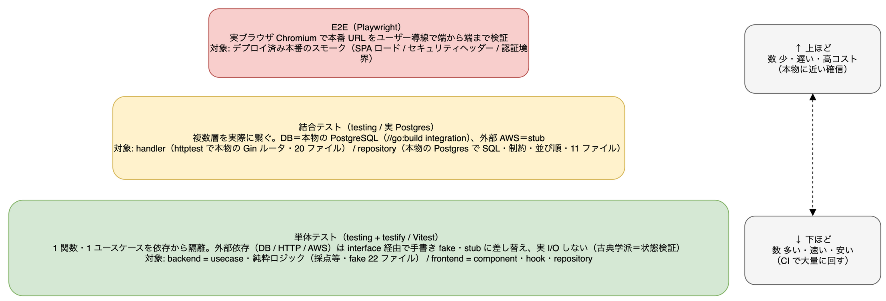
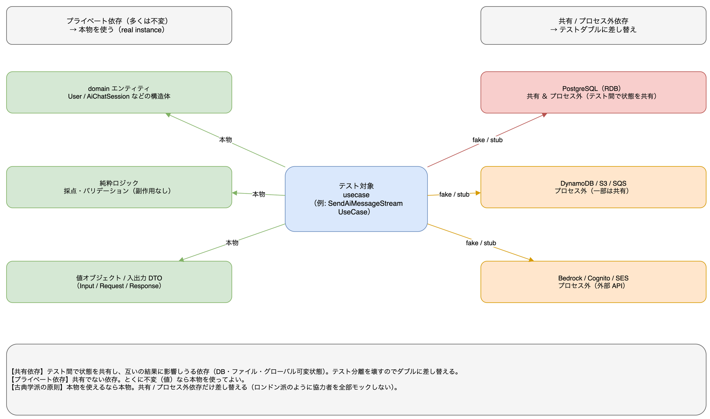
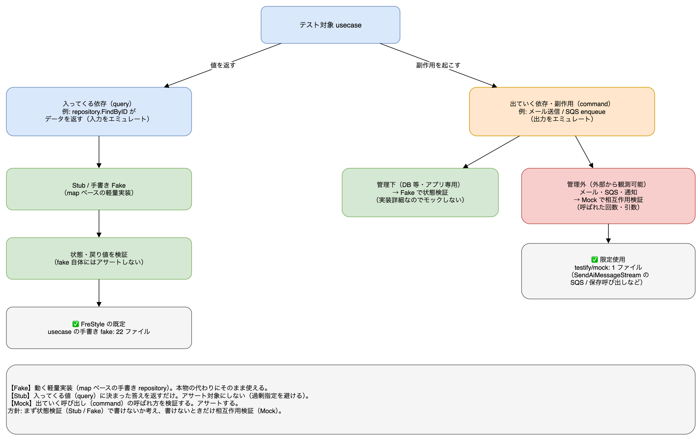

# 単体テストの考え方（FreStyle のテスト哲学）

FreStyle のバックエンド（Go）/ フロントエンド（React）で「何を・どう単体テストするか」の方針をまとめる。`CLAUDE.md` §3.3（テスト規約）の背景説明であり、新しく参加するメンバーが既存テストを読む / 書くときの指針。

結論を先に言うと、**FreStyle は「古典学派（Classicist / Detroit school）」を採用**している。

## テスト戦略の全体像（単体 / 結合 / E2E）

種別ごとの「定義 / 対象 / ツール」は次のとおり。**下ほど数が多く・速く・安い**、**上ほど本物に近い確信**が得られる（テストピラミッド）。

| 種別 | このアプリでの定義 | 主な対象 | ツール / 実行 |
|---|---|---|---|
| **単体（unit）** | 1 つの関数・ユースケースを依存から隔離して検証する。外部依存（DB / HTTP / AWS）は interface 経由で**手書き fake / stub に差し替え**、実 I/O を行わない（古典学派＝状態検証） | backend: usecase / 純粋ロジック（採点等） / frontend: component・hook・repository | `testing` + `testify` / Vitest |
| **結合（integration）** | 複数層を実際に繋いで検証する。DB は**本物の PostgreSQL**（`//go:build integration`）、外部 AWS は stub に差し替える | backend: handler（`httptest` で本物の Gin ルータ）・repository（本物の Postgres で SQL / 制約 / 並び順） | `testing` / Postgres |
| **E2E** | **実ブラウザ（Chromium）**で本番 URL に対しユーザー導線を端から端まで検証する | デプロイ済み本番のスモーク（SPA ロード / セキュリティヘッダー / 認証境界） | Playwright |

## 1. 2 つの学派（古典派 vs ロンドン派）

単体テストには大きく 2 つの流儀がある。

| | **古典学派（Classicist / Detroit）** | **ロンドン学派（Mockist / London）** |
|---|---|---|
| 代表 | Kent Beck『TDD by Example』の流れ | Freeman & Pryce『GOOS』の流れ |
| 「単体」の単位 | **振る舞い（1 つの仕事）**。複数クラスをまたいでもよい | **1 クラス**。協力者は全部モック |
| 協力者（依存） | 本物を使えるなら本物。DB / 外部 API など扱いにくい境界だけ差し替える | テスト対象の協力者を**すべてモック**にする |
| 検証の主眼 | **状態 / 戻り値**（実行後にこうなっている） | **相互作用**（どのメソッドが何回・どの引数で呼ばれたか） |
| 設計の駆動 | テストは振る舞いの仕様 | モックで「外側から内側へ」設計を駆動 |

どちらが正解ということはなく、**チームで揃えること**が大事。揃っていないと「あるテストは状態検証、別のは相互作用検証」でレビュー基準がブレる。

## 2. FreStyle の採用：古典学派

実際のテストコードがそれを示している（backend/internal 現況）:

- **手書き fake（`type fakeXxx struct`）を使うテスト: 22 ファイル** … 依存は interface を満たす小さな fake で差し替え、**戻り値 / 状態を検証**する
- **実 Postgres を使う結合テスト（`//go:build integration`）: 11 ファイル** … repository は本物の DB に対して検証（クエリ・制約・並び順の正しさはモックでは確かめられない）
- **`httptest` で本物の Gin ルータを通す handler テスト: 20 ファイル** … usecase だけ fake にし、ルーティング・バインド・ステータス・JSON を本物で検証
- **`testify/mock` の使用: わずか 1 ファイル** … 相互作用の検証が本質のところだけに限定

つまり「**本物を使えるところは本物（実 DB・実ルータ）、扱いにくい依存だけ手書き fake、検証は状態 / 出力**」という古典派の典型。

### 何を本物にし、何を差し替えるか（共有依存 vs プライベート依存）

古典学派では「全部モック」ではなく、**共有依存 / プロセス外依存だけ**をテストダブルに差し替える。判断軸は「テスト間で状態を共有してしまうか」。

- **共有依存**: テスト間で状態を共有し、互いの結果に影響しうる依存（DB・ファイル・グローバル可変状態）。テスト分離を壊すのでダブルに差し替える
- **プライベート依存**: 共有でない依存。とくに**不変（値）なら本物を使ってよい**（domain エンティティ・値オブジェクト・純粋ロジック）
- FreStyle では DB（共有 ＆ プロセス外）や AWS 各種（プロセス外）だけをダブルにし、domain / 純粋ロジックは本物のまま組み立てて結果を検証する

### なぜ古典派か

- **リファクタ耐性が高い**: 内部の呼び出し手順ではなく「結果」を検証するので、実装の詳細（どの順でどのメソッドを呼ぶか）を変えてもテストが壊れにくい。モック過多のテストは実装を少し変えるたびに赤くなり、リグレッション検出より保守コストが勝ってしまう
- **本物に近い**: repository は実 Postgres、handler は実ルータ。`FILTER` / `BOOL_OR` のような Postgres 固有挙動や、middleware・バインドのつなぎ目を**実際に**通すので、本番に近い確信が得られる
- **クリーンアーキテクチャと相性が良い**: 依存を interface にしている目的は「DI / 層の分離（DIP）」であって「全部モックするため」ではない。だから usecase テストでも、相互作用を縛るより**fake が返す状態で結果を検証**する

## 3. 層ごとの指針（具体）

| 層 | 何を本物に / 何を差し替えるか | 検証の主眼 |
|---|---|---|
| **usecase** | repository / infra を **手書き fake**（map で状態・`err` フィールドでエラー注入） | `Execute` の**戻り値・エラー**（状態検証） |
| **repository** | **本物の Postgres**（`//go:build integration` + `testsupport.OpenTestDB`） | クエリ結果・並び順・スコープ・制約 |
| **handler** | 本物の `gin` ルータ（`httptest`）+ usecase は fake | ステータス・JSON 形状・バリデーション・認証分岐 |
| **infra** | 外部サービス（S3 / Bedrock / SQS 等）は境界の interface で stub | 入出力の変換・エラー伝搬 |

### モック（相互作用検証）を使ってよい場面

古典派でも**相互作用そのものが仕様**のときはモック（`testify/mock`）でよい。例:

- 「ウェルカムメールが**ちょうど 1 回**送られる」
- 「レポート生成ジョブが SQS に**enqueue される**」

このように「呼ばれたこと自体」が振る舞いの本質なら、`mock.On(...).Return(...)` + `AssertExpectations` で呼び出しを検証する。**まず状態検証で書けないかを考え、書けないときだけ相互作用検証**、が健全な順番。

テストダブルは「**入ってくる依存（query）**」と「**出ていく依存（command）**」で使い分ける。

- **query（値を返す）** → Stub / 手書き Fake で**状態を検証**（fake 自体にはアサートしない＝過剰指定を避ける）。FreStyle の既定で、usecase テストの大半（fake 22 ファイル）はこれ
- **command（副作用を起こす）** のうち、**管理下依存**（アプリ専用の DB 等）は Fake の状態検証で済ませる。**管理外依存**（メール送信・SQS enqueue など外部から観測できるもの）だけ Mock で**相互作用を検証**する（`testify/mock` 1 ファイルに限定）

用語の整理:

- **Fake**: 動く軽量実装（map ベースの手書き repository）。本物の代わりにそのまま使える
- **Stub**: 入ってくる値（query）に決まった答えを返すだけ。アサート対象にしない
- **Mock**: 出ていく呼び出し（command）の呼ばれ方を検証する。アサートする

## 4. 書き方の実例

手書き fake と相互作用検証の実コードは、教材コース **「テスト徹底入門 — Go で学ぶ単体テストとモック」（course id 15）** の以下の章にある:

- 007 手書き fake リポジトリ（FreStyle 流・状態検証）
- 008 testify/mock（相互作用検証・使い分け）
- 009 sqlite / 実 Postgres による DB 単体テスト
- 010 httptest + gin の handler テスト

フロントエンド（Vitest + React Testing Library）も同じ思想で、`render` + `screen.getByRole` で**ユーザーに見える結果**を検証し、内部の呼び出し詳細はなるべく検証しない。

## 5. まとめ（チーム規約）

- FreStyle は **古典学派**。本物を使えるところは本物（実 DB・実ルータ）、扱いにくい依存だけ手書き fake、**検証は状態 / 出力**
- `testify/mock`（相互作用検証）は「呼ばれたこと自体が仕様」のときに限定して使う
- 迷ったら「実装の手順」ではなく「**結果がこうなっている**」を検証する（リファクタ耐性を優先）
